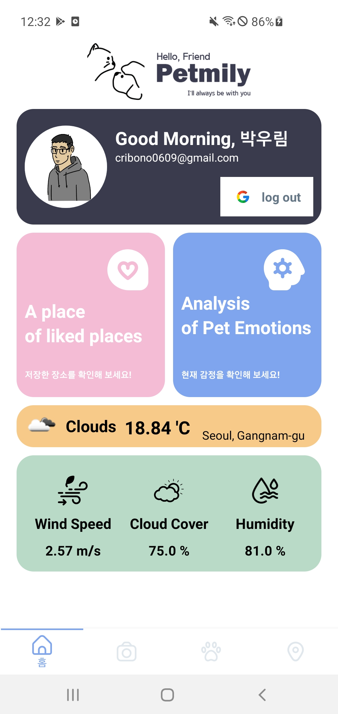

# Petmily Android Application 기능 구현

## 목차

- [[#Client 부문|Client 부문]]
- [[#각 액티비티 기능 설명|각 액티비티 기능 설명]]
- [[#로딩 화면|로딩 화면]]
		- [[#splashActivity.kt|splashActivity.kt]]
- [[#메인 화면|메인 화면]]
		- [[#MainActivity.kt|MainActivity.kt]]
- [[#홈 화면|홈 화면]]
		- [[#HomeFragment.kt|HomeFragment.kt]]
	- [[#홈 화면#로그인|로그인]]
		- [[#로그인#구글 로그인|구글 로그인]]
	- [[#홈 화면#날씨|날씨]]
		- [[#날씨#WeatherAPIClient.kt|WeatherAPIClient.kt]]
		- [[#날씨#WeatherAPIService.kt|WeatherAPIService.kt]]
		- [[#날씨#RemoteDataSourceImpl.kt|RemoteDataSourceImpl.kt]]
		- [[#날씨#HomeFragment.kt 날씨 띄우기|HomeFragment.kt 날씨 띄우기]]
- [[#동물 감정 분석|동물 감정 분석]]
		- [[#날씨#AnalysisFragment.kt|AnalysisFragment.kt]]
		- [[#날씨#ResultFragment.kt|ResultFragment.kt]]
- [[#커뮤니티|커뮤니티]]
	- [[#커뮤니티#게시물 가져오기|게시물 가져오기]]
		- [[#게시물 가져오기#PostFragment.kt|PostFragment.kt]]
		- [[#게시물 가져오기#RetrofitService|RetrofitService]]
		- [[#게시물 가져오기#게시물 가져오기 getPost|게시물 가져오기 getPost]]
	- [[#커뮤니티#게시물 작성|게시물 작성]]
		- [[#게시물 작성#PostUploadFragment.kt|PostUploadFragment.kt]]
		- [[#게시물 작성#postUpload|postUpload]]
	- [[#커뮤니티#좋아요|좋아요]]
		- [[#좋아요#PostLikeFragment.kt|PostLikeFragment.kt]]
		- [[#좋아요#LikeRetrofitService|LikeRetrofitService]]
		- [[#좋아요#좋아요 표시 postLike|좋아요 표시 postLike]]
		- [[#좋아요#좋아요 삭제 deleteData|좋아요 삭제 deleteData]]
		- [[#좋아요#좋아요 개수 getCountLike|좋아요 개수 getCountLike]]
		- [[#좋아요#좋아요 했는지 확인 aboutLike|좋아요 했는지 확인 aboutLike]]
	- [[#커뮤니티#좋아요 모아보기|좋아요 모아보기]]
		- [[#좋아요 모아보기#PostUploadFragment.kt|PostUploadFragment.kt]]
	- [[#커뮤니티#댓글|댓글]]
		- [[#댓글#CommentFragment.kt|CommentFragment.kt]]
- [[#산책|산책]]
	- [[#산책#산책 저장 확인|산책 저장 확인]]
		- [[#산책 저장 확인#WalkFragment.kt|WalkFragment.kt]]
		- [[#산책 저장 확인#DetailTrackingFragment.kt|DetailTrackingFragment.kt]]
	- [[#산책#실시간 산책 기록|실시간 산책 기록]]
		- [[#실시간 산책 기록#TrackingFragment.kt|TrackingFragment.kt]]
- [[#장소|장소]]
	- [[#장소#장소 검색|장소 검색]]
		- [[#장소 검색#MapFragment.kt|MapFragment.kt]]
	- [[#장소#즐겨찾기|즐겨찾기]]
		- [[#즐겨찾기#LikePlaceFragment.kt|LikePlaceFragment.kt]]
- [[#Server 부문|Server 부문]]
	- [[#Server 부문#Spring|Spring]]
	- [[#Server 부문#Flask|Flask]]


## Client 부문

##   각 액티비티 기능 설명

| 클래스   | 기능                     | layout                       |
| -------- | ------------------------ | ---------------------------- |
| Home     | 구글 로그인, 날씨        | fragment_home.xml            |
| Analysis | 동물 감정 분석           | fragment_analysis.xml        |
|          | 동물 감정 분석 결과      | fragment_result.xml          |
| BookMark | 즐겨 찾기 장소 보기      | fragment_likeplace.xml       |
| Post     | 게시물 보기              | fragment_post.xml            |
|          | 게시물 업로드            | fragment_upload.xml          |
|          | 좋아요 한 게시물 보기    | fragment_post_like.xml       |
|          | 댓글 보기                | fragment_comment.xml         |
| Walk     | 날짜별 산책 기록 보기    | fragment_walk.xml            |
|          | 산책 기록 자세히 보기    | fragment_detail_tracking.xml |
|          | 산책 시작 후 트래킹 모드 | fragment_tracking.xml        |
| Map      | 장소 검색                | fragment_map.xml             |

## 로딩 화면

어플이 실행 되면 가장 먼저 보여지는 화면이다.

(로딩 화면 추가)

#### splashActivity.kt

Handler 를 이용해 2초의 딜레이 진행 뒤에야 MainActivity 화면으로 전환 된다.

```kotlin
Handler(Looper.getMainLooper()).postDelayed({  
	val intent =  
		Intent(baseContext, MainActivity::class.java)  
	    startActivity (intent)  
	    finish()  
    }, 2000)
```

## 메인 화면

#### MainActivity.kt

BottomNavigationView를 이용해 하단 탭으로 화면을 이동한다.
총 4개의 화면으로 구성되어 있으며 초기 화면은 HomeFragment으로 설정되어 있다.

```kotlin
bottomNavigationView.setOnItemSelectedListener { item ->  
  val account = GoogleSignIn.getLastSignedInAccount(this)  
    if(account != null) {  
        when (item.itemId) {  
            R.id.home -> navController.navigate(R.id.homeFragment)  
            R.id.story -> navController.navigate(R.id.postFragment)  
            R.id.walk -> navController.navigate(R.id.walkFragment)  
            R.id.map -> navController.navigate(R.id.mapFragment)  
        }  
        true  
  } else {  
        Toast.makeText(this,"로그인후 이용해주세요",Toast.LENGTH_SHORT).show()  
        true  
  }  
}
```

## 홈 화면

#### HomeFragment.kt



### 로그인

로그인 방법은 구글 로그인이다.
만약 로그인이 되어 있지 않다면 버튼을 누르더라도 홈 화면이 아닌 다른 화면으로 넘어가지 못한다.

#### 구글 로그인

```kotlin
 private fun handleSignInResult(completedTask: Task<GoogleSignInAccount>) {  
        try {  
            val account = completedTask.getResult(ApiException::class.java)  
  updateUI(account)  
        } catch (e: ApiException) {  
            Log.w("Google", "signInResult:failed code=" + e.statusCode)  
            updateUI(null)  
        }  
    }
    
    private fun googleSet() {  
    val gso = GoogleSignInOptions.Builder(GoogleSignInOptions.DEFAULT_SIGN_IN)  
        .requestEmail()  
        .build()  
  
    mGoogleSignInClient = GoogleSignIn.getClient(requireActivity(), gso)  
}
```

### 날씨

OpenWeatherMap API에서 Retrofit을 이용해 날씨 상태를 받아와 실시간으로 보여준다.
현재 온도, 바람, 구름, 습도를 확인할 수 있다.

#### WeatherAPIClient.kt

```kotlin
object WeatherAPIClient {  
    fun getClient(url: String): Retrofit {  
        val okHttpClient: OkHttpClient = OkHttpClient.Builder().addInterceptor(CookiesIntercepter())  
            .addNetworkInterceptor(CookiesIntercepter()).build()  
  
        val retrofit: Retrofit = Retrofit.Builder().baseUrl(url)  
            .addConverterFactory(GsonConverterFactory.create())  
            .client(okHttpClient)  
            .build()  
  
        return retrofit  
    }  
}
```

#### WeatherAPIService.kt

```kotlin
@GET("data/2.5/{path}")  
fun doGetJsonDataWeather(  
    @Path("path") path: String,  
	@Query("q") q: String,  
	@Query("appid") appid: String,  
): Call<WeatherModel>
```

#### RemoteDataSourceImpl.kt

```kotlin
override fun getWeatherInfo(  
    jsonObject: JSONObject,  
	onResponse: (Response<WeatherModel>) -> Unit,  
	onFailure: (Throwable) -> Unit  
	) {  
    val APIService: WeatherAPIService = WeatherAPIClient.getClient(  
        jsonObject.get("url").toString()  
		).create(WeatherAPIService::class.java)  
		APIService.doGetJsonDataWeather(  
	        jsonObject.get("path").toString(),  
			jsonObject.get("q").toString(),  
			jsonObject.get("appid").toString()  
		).enqueue(object :  
        Callback<WeatherModel> {  
        override fun onResponse(call: Call<WeatherModel>, response: Response<WeatherModel>) {  
            onResponse(response)  
        }  
        override fun onFailure(call: Call<WeatherModel>, t: Throwable) {  
            onFailure(t)  
        }  
    }  
    )  
}
```

#### HomeFragment.kt 날씨 띄우기

```kotlin
private fun initWeatherView() {  
    viewModel = ViewModelProvider(this).get(WeatherViewModel::class.java)  
    var jsonObject = JSONObject()  
    jsonObject.put("url", getString(R.string.weather_url))  
    jsonObject.put("path", "weather")  
    jsonObject.put("q", "Seoul")  
    jsonObject.put("appid", getString(R.string.weather_app_id))  
    viewModel.getWeatherInfoView(jsonObject)  
}

private fun observeData() {  
    viewModel.isSuccWeather.observe(  
        viewLifecycleOwner, Observer { it ->  
			if (it) {  
                viewModel.responseWeather.observe(  
                    viewLifecycleOwner, Observer { setWeatherData(it) }  
                )  
			}  
		}  
	)  
}  
  
private fun setWeatherData(model: WeatherModel) {  
    val temp = model.main.temp!!.toDouble() - 273.15  
	val weatherImgUrl = "http://openweathermap.org/img/w/" + model.weather[0].icon + ".png"  
	binding.currentTemp.text =  
        StringBuilder().append(String.format("%.2f", temp)).append(" 'C").toString()  
    binding.currentMain.text = model.weather[0].main  
	binding.windSpeed.text = StringBuilder().append(model.wind.speed).append(" m/s").toString()  
    binding.cloudCover.text = StringBuilder().append(model.clouds.all).append(" %").toString()  
    binding.humidity.text = StringBuilder().append(model.main.humidity).append(" %").toString()  
    Glide.with(this).load(weatherImgUrl).into(binding.weatherImg)  
}
```

```kotlin
override fun onViewCreated(view: View, savedInstanceState: Bundle?) {  
    super.onViewCreated(view, savedInstanceState)
    ''''
    initWeatherView()
    observeData() 
}
```

## 동물 감정 분석


개, 고양이가 있는 사진을 선택하고 전송하여 감정 분석 값을 받아볼 수 있다.

* 사진을 앨범에서 고르거나 카메라로 찍어서 전송한다.
* 로딩 시간이 흐른 후 결과를 받아온다.
* 결과 값은 개, 고양이의 종과 화남, 행복, 슬픔의 감정을 퍼센트로 보내준다.

#### AnalysisFragment.kt

앨범, 카메라 접근 권한이 있는지 확인한다.

```kotlin
private fun getPermissions() {  
    if (ContextCompat.checkSelfPermission(  
	    requireContext(),  
		Manifest.permission.CAMERA  
	)  
		!= PackageManager.PERMISSION_GRANTED &&  
        ContextCompat.checkSelfPermission(  
            requireContext(),  
			Manifest.permission.WRITE_EXTERNAL_STORAGE  
	)  
        != PackageManager.PERMISSION_GRANTED &&  
        ContextCompat.checkSelfPermission(  
            requireContext(),  
			Manifest.permission.READ_EXTERNAL_STORAGE  
	)  
        != PackageManager.PERMISSION_GRANTED  
  ) {  
        ActivityCompat.requestPermissions(  
            requireActivity(),  
			PERMISSIONS,  
			PERMISSIONS_REQUEST  
		)  
    }  
}
```

앨범 또는 카메라를 선택한다. 
다음 ResultFragment 에서 무엇을 선택했는지 알기 위해 navArgs을 이용한다.

```kotlin
override fun onViewCreated(view: View, savedInstanceState: Bundle?) {  
    super.onViewCreated(view, savedInstanceState)  
    getPermissions()  
    binding.takePicture.setOnClickListener {  
    var action = AnalysisFragmentDirections.actionAlbumFragmentToResultFragment(1) //앨범 선택 1
    findNavController().navigate(action)  
    } 
    binding.selectPicture.setOnClickListener {  
    var action = AnalysisFragmentDirections.actionAlbumFragmentToResultFragment(2) //카메라 선택 2
    findNavController().navigate(action)  
    }  
}
```

#### ResultFragment.kt

사진을 서버로 전송하기 위해 Retrofit을 이용한다.

```kotlin
override fun onViewCreated(view: View, savedInstanceState: Bundle?) {  
    super.onViewCreated(view, savedInstanceState)  
    val analyArgs by navArgs<ResultFragmentArgs>()  
	val seletNum: Int = analyArgs.selectNum
    var gson = GsonBuilder().setLenient().create()  
    val retrofit = Retrofit.Builder()  
        .baseUrl("http://ec2-54-180-166-236.ap-northeast-2.compute.amazonaws.com:8080/")  
        .client(client)  
        .addConverterFactory(GsonConverterFactory.create(gson))  
        .build()  
    analysisApi = retrofit.create(AnalysisService::class.java)  
    if (seletNum == 1) {  
	    openCamera()  
	} else {  
	    openGallery()  
	}
}
```

감정 분석 리턴 값을 생성한다.

```kotlin
class AnalysisResult(  
    val type: String, val cropPosition: CropPosition, val breed: Breed, val emotion: Emotion  
)
class CropPosition(  
    val leftX: Int, val leftY: Int, val rightX: Int, val rightY: Int  
)  
class Emotion(  
    val angry: Float, val sad: Float, val happy: Float  
)  
class Breed(  
    val top1: String, val top1_result: Float  
)
```

감정 분석 Retrofit Api을 생성한다.

```kotlin
interface AnalysisService {  
	@Multipart  
	@POST("api/analysis/emotion")  
    fun getEmotion(  
        @Part img: MultipartBody.Part  
    ): Call<AnalysisResult>  
}
```

앨범을 열어 사진을 선택 후 전송한다.

```kotlin
private val imagePickerLauncher =  
    registerForActivityResult(ActivityResultContracts.StartActivityForResult()) {  
		val petImageUri = it.data?.data  
		Glide.with(this).load(petImageUri).centerCrop().into(binding.petImg)  
	    petImageUri?.let { it1 -> getEmotion(it1) }  
	    }
	    
private fun openGallery() {  
    imagePickerLauncher.launch(  
      Intent.createChooser(Intent(Intent.ACTION_GET_CONTENT).apply {  
	  type = "image/*"  
	  }, "사진 선택하기")  
    )  
}
```

카메라로 사진을 찍고 전송한다.

```kotlin
private fun openCamera() {  
    var petImageUri: Uri? = null  
	resultLauncher =  
        registerForActivityResult(ActivityResultContracts.StartActivityForResult()) {  
	        if (it.resultCode == RESULT_OK) {  
                val option = BitmapFactory.Options()  
                option.inSampleSize = 10  
                val bitmap = BitmapFactory.decodeFile(filePath, option)  
                Glide.with(this).load(petImageUri).centerCrop().into(binding.petImg)  
                petImageUri?.let { it1 -> getEmotion(it1) }  
                }  
             }  
	val filename = "${System.currentTimeMillis()}.jpeg"  
	val storageDir: File? =  
        (activity as MainActivity).getExternalFilesDir(Environment.DIRECTORY_PICTURES)  
  
    val file = File.createTempFile(filename, ".jpeg", storageDir)  
    filePath = file.absolutePath  
    petImageUri = FileProvider.getUriForFile(  
        activity as MainActivity,  
		"com.bagooni.petmliy_android_app",  
		file  
	)  
    val intent = Intent(MediaStore.ACTION_IMAGE_CAPTURE)  
    intent.putExtra(MediaStore.EXTRA_OUTPUT, petImageUri)  
    resultLauncher.launch(intent)  
}
```

서버로 사진을 post하고 감정 분석을 받아온다.

```kotlin
private fun getEmotion(petImgUri: Uri) {  
        val bitmap = petImgUri?.let { it1 -> loadBitmapFromMediaStoreBy(it1) }  
        val uploadFile = bitmapToRequestBody("img", bitmap)  
        val loading = LoadingDialog(activity as MainActivity)  
        loading.show()  
  
        analysisApi.getEmotion(uploadFile).enqueue(object : Callback<AnalysisResult> {  
            override fun onResponse(  
                call: Call<AnalysisResult>,  
                response: Response<AnalysisResult>  
            ) {  
                if (response.isSuccessful) {  
                    Log.d("response",response.body().toString())  
                    val result = response.body()  
                    result?.let { updateUI(it) }  
                    loading.dismiss()
                    }else{  
                    Toast.makeText(activity as MainActivity,"동물 사진이 아닙니다.",
                    Toast.LENGTH_SHORT).show()  
                    findNavController().navigate(R.id.albumFragment)  
                    loading.dismiss()  
                }  
            }  
            override fun onFailure(call: Call<AnalysisResult>, t: Throwable) {  
                Log.d("onFailure",t.message.toString())  
                Toast.makeText(activity as MainActivity,"동물 사진이 아닙니다.", Toast.LENGTH_SHORT).show()  
                findNavController().navigate(R.id.albumFragment)  
                loading.dismiss()  
            }  
        })  
    }
```

받아온 감정 분석 정보를 화면 UI에 업데이트한다.

```kotlin
private fun updateUI(result: AnalysisResult){  
    binding.petType.text = result.type  
    binding.petBreed.text = StringBuilder().append(result.breed.top1)  
        .append("(")  
        .append(String.format("%.2f", result.breed.top1_result))  
        .append("%)")  
  
    var emotionMap = HashMap<String, Float>()  
    emotionMap["Angry"] = result.emotion.angry  
    emotionMap["Happy"] = result.emotion.happy  
    emotionMap["Sad"] = result.emotion.sad  

	val maxValue = Collections.max(emotionMap.values)
	//퍼센트 값이 가장 큰 감정 찾기 
    emotionMap.entries.stream().forEach { entry ->  
		if (entry.value == maxValue) {  
            binding.petEmotion.text = StringBuilder().append(entry.key)  
                .append("(").append(entry.value).append(")")  
        }  
    } 
	binding.petEmotionSet.text = StringBuilder()  
        .append("Angry(").append(emotionMap["Angry"]).append("%) ")  
        .append("Happy(").append(emotionMap["Happy"]).append("%) ")  
        .append("Sad(").append(emotionMap["Sad"]).append("%)")  
}
```

## 커뮤니티


자신의 반려 동물 사진을 올리고 여러 사람들과 소통하며 공유할 수 있다.

* 강아지, 고양이 사진만 업로드할 수 있다.
* 자동으로 태그를 달아준다. (종 분류, 감정 분석)
* 게시글마다 좋아요, 댓글, 공유를 할 수 있다.
* 자신이 '좋아요'한 게시물을 모아볼 수 있다.

### 게시물 가져오기

#### PostFragment.kt

게시물을 서버로부터 받아오기 위해 Retrofit을 이용한다.

```kotlin
override fun onViewCreated(view: View, savedInstanceState: Bundle?) {  
    super.onViewCreated(view, savedInstanceState)
    val feedListView = view.findViewById<RecyclerView>(R.id.feedList)  
	var gson = GsonBuilder().setLenient().create()  
    val retrofit = Retrofit.Builder()  
        .baseUrl("http://ec2-54-180-166-236.ap-northeast-2.compute.amazonaws.com:8080/")  
        .client(client)  
        .addConverterFactory(GsonConverterFactory.create(gson))  
        .build()  
    retrofitService = retrofit.create(RetrofitService::class.java)
```

#### RetrofitService

게시물 받아오는 데이터 모델과 인터페이스를 생성한다.

```kotlin
class Post(  
    val postId: Long, val userImg: String, val email: String, val postImg: String,  
    val postContent: String, val tags: String  
)
interface RetrofitService {   
    //포스트 가져오기  
  @GET("api/post/findAll")  
    fun getPost(  
    ): Call<ArrayList<Post>>   
}
```

게시글은 RecyclerView와 Adapter로 구성한다.

```kotlin
class PostRecyclerViewAdapter(  
    val postList: ArrayList<Post>,  
	val inflater: LayoutInflater,  
	val glide: RequestManager,  
	val postFragment: PostFragment,  
	val activity: MainActivity,  
	val shareButton: (String) -> Unit  
) : RecyclerView.Adapter<PostRecyclerViewAdapter.ViewHolder>() {

	inner class ViewHolder(itemView: View) : RecyclerView.ViewHolder(itemView) {  
	    val userImg: ImageView  
	    val userName: TextView
	    ...
	    init {  //itemView와 연결
		    userImg = itemView.findViewById(R.id.userImg)  
		    userName = itemView.findViewById(R.id.userEmail)
		    ...
		}
	}
	override fun onCreateViewHolder(parent: ViewGroup, viewType: Int): ViewHolder {  
	    return ViewHolder(inflater.inflate(R.layout.post_recyclerview_item, parent, false))  
    }
    override fun onBindViewHolder(holder: ViewHolder, position: Int) {  
	    val post = postList[position]
	    ...
	}
}
```

#### 게시물 가져오기 getPost

인터페이스 getPost 함수를 이용해 서버에서 게시글을 받아온다.

```kotlin
private fun getPost() {  
    val loading = LoadingDialog(activity as MainActivity)  
    loading.show()  
    retrofitService.getPost().enqueue(object : Callback<ArrayList<Post>> {  
        override fun onResponse(  
            call: Call<ArrayList<Post>>,  
			response: Response<ArrayList<Post>>  
        ) {  
            val postList = response.body()  
            val postRecyclerView = view?.findViewById<RecyclerView>(R.id.feedList)  
            postRecyclerView?.adapter = postList?.let {  PostRecyclerViewAdapter(  
                    it,  
                    LayoutInflater.from(activity),  
                    Glide.with(activity!!),  
                    this@PostFragment,  
                    activity as (MainActivity),  
                    shareButton = {
                        val bytes = Base64.decode(it, Base64.DEFAULT)  
                        val changeImg = BitmapFactory.decodeByteArray(bytes, 0, bytes.size)  
                        bitmapToUri(changeImg)  
                    }  
	             )  
             }  
        }  
  
        override fun onFailure(call: Call<ArrayList<Post>>, t: Throwable) {  
            Log.d("log", t.message.toString())  
        }  
    })  
}
```

Retrofit 응답 객체(Response<ArrayList<Post>>)를 받고 adapter로 RecyclerView에 item과 각각 연결한다.

```kotlin
override fun onBindViewHolder(holder: ViewHolder, position: Int) {  
    val post = postList[position]  
  
    post.userImg.let {  glide.load(it).centerCrop().circleCrop().into(holder.userImg) }  
  
	if (post.postImg.isNotEmpty()) {  
        val byte = Base64.decode(post.postImg, Base64.DEFAULT)  
        val img: Bitmap = BitmapFactory.decodeByteArray(byte, 0, byte.size)  
        holder.postImg.setImageBitmap(img)  
    }  
    holder.postUserName.text = post.email.split("@")[0]  
    holder.userName.text = post.email.split("@")[0]  
    holder.postContent.text = post.postContent  
    //자동 태그
    ("#" + post.tags.replace(", ", " #")).also { holder.tagText.text = it }  
  
	if (post.email == postFragment.personEmailInput) {  
        holder.deleteBtn.visibility = VISIBLE  
	}  
}
```

### 게시물 작성

자신의 반려 동물 사진을 올려 다른 사람들과 공유할 수 있다.

* 개, 고양이가 없는 사진은 업로드할 수 없다.

#### PostUploadFragment.kt

앨범 속 사진이나 카메라로 찍은 사진과 짧을 글을 써서 게시글을 작성하는 화면이다.

* 감정 분석에 있는 imagePickerLauncher, cameraLauncher을 사용해서 사진을 선택한 후 똑같이 RequestBody로 바꾼다.

#### postUpload

게시글 내용을 서버에 전송하는 함수이다.
개, 고양이 사진이 없는 경우 Toast 실패 메세지를 출력하고 전송에 성공하면 Toast 성공 메세지 출력 후 포스트 화면으로 이동한다.

```kotlin
private fun postUpload(postImageUri: Uri) {  
    var gson = GsonBuilder().setLenient().create()  
    val retrofit = Retrofit.Builder()  
        .baseUrl("http://ec2-54-180-166-236.ap-northeast-2.compute.amazonaws.com:8080/")  
        .client(client)  
        .addConverterFactory(GsonConverterFactory.create(gson))  
        .build()  
    val retrofitService = retrofit.create(RetrofitService::class.java)  
  
    //입력문구 얻어옴  
	contentInput = binding.postContent.text.toString()
	//로딩화면
    val loading = LoadingDialog(activity as MainActivity)  
    loading.show()
    //게시글 내용
    val postContent = MultipartBody.Part.createFormData("postContent", contentInput)
    //유저 이미지
    val userUploadFile = MultipartBody.Part.createFormData("userImg", userImgUri)  
    //게시글 사진을 비트맵으로 변환
    val bitmap = postImageUri?.let { it1 -> loadBitmapFromMediaStoreBy(it1) }
    //비트맵으로 변환한 사진을 requestBody로 변환 
    val uploadFile = bitmapToRequestBody("postImg", bitmap)  
  
    if (uploadFile != null) {  
        retrofitService.postUpload(personEmailInput, uploadFile, postContent, userUploadFile)  
            .enqueue(object : Callback<Post> {  
                override fun onResponse(call: Call<Post>, response: Response<Post>) {  
                    if (response.isSuccessful) {
                        Log.d("log", response.toString())  
                    } else {
	                    //개, 고양이 사진이 아닐 경우 
                        Toast.makeText(  
                            activity as MainActivity, "동물 사진이 아닙니다.", Toast.LENGTH_SHORT).show()  
                        findNavController().navigate(R.id.postUploadFragment)  
                        loading.dismiss()  //로딩화면 멈추기
                    }  
                }  
                override fun onFailure(call: Call<Post>, t: Throwable) { 
                    Toast.makeText(activity as MainActivity, "포스트 업로드했습니다.", Toast.LENGTH_SHORT)  
                        .show()  
                    findNavController().navigate(R.id.postFragment)  
                    loading.dismiss()  
                }  
            })  
    }  
  
}
```

### 좋아요

게시물을 구경하다 마음에 드는 게시물에 '좋아요'로 공감할 수 있다.

* 좋아요 누른 게시물은 분홍색 하트로 표현되고 누르지 않은 게시물은 투명 하트로 표시한다.
* 몇 명이 '좋아요'를 눌렀는지 표시한다.
* 하트 버튼을 누름으로써 '좋아요' 또는 '좋아요'를 취소할 수 있다.
* '좋아요' 한 게시물 모아보기

#### PostLikeFragment.kt

* 모든 게시물은 원래 투명 하트로 표시하고 클릭 시 분홍 하트로 바뀌고 이미지 위에 하얀 하트가 1초 동안 보일 수 있도록 한다.
* 바로 화면을 바꾸고 순서대로 진행하기 위해 쓰레드를 이용한다.

```kotlin
class PostRecyclerViewAdapter(  
    val postList: ArrayList<Post>, 
    ...
) : RecyclerView.Adapter<PostRecyclerViewAdapter.ViewHolder>() {  
  
    inner class ViewHolder(itemView: View) : RecyclerView.ViewHolder(itemView) {  
        ... 
        val favoriteBtn: ImageButton  
        val favoriteColorBtn: ImageButton  
        ...
  
        init {  
            ...
            favoriteBtn = itemView.findViewById(R.id.favoriteBtn) //좋아요 버튼  
			favoriteColorBtn = itemView.findViewById(R.id.favoriteColorBtn) //좋아요 색 버튼  
            postLayer = itemView.findViewById(R.id.postLayer)  //사진 하얀 배경  
			postHeart = itemView.findViewById(R.id.postHeart)  //사진 위 하얀 하트
            countLike = itemView.findViewById(R.id.likeCount)  //좋아요 개수 
            ...
  
            favoriteBtn.setOnClickListener {  
				Thread {  
					postFragment.postLike(postList[adapterPosition].postId)  
					activity.runOnUiThread {  
	                    favoriteColorBtn.visibility = VISIBLE  //분홍 하트 표시
	                    postLayer.visibility = VISIBLE  
	                    postHeart.visibility = VISIBLE  
	                }  
					Thread.sleep(1000)  //1초간 쉼
					activity.runOnUiThread { 
	                    postLayer.visibility = INVISIBLE  
	                    postHeart.visibility = INVISIBLE  
	                    postFragment.getCountLike(postList[adapterPosition].postId, countLike)  //좋아요 개수 업데이트
	                }  
	            }.start()  
			}  
  
			favoriteColorBtn.setOnClickListener {  
				Thread {  
					activity.runOnUiThread {  
					postFragment.deleteData(postList[adapterPosition].postId)  //좋아요 취소
					favoriteColorBtn.visibility = INVISIBLE  
					}  
					Thread.sleep(1000)  
                    activity.runOnUiThread {  
                    postFragment.getCountLike(postList[adapterPosition].postId, countLike) //좋아요 개수 업데이트 
                    }  
                }.start()  
			}  
		}  
	}
```

#### LikeRetrofitService

```kotlin
class Like(  
    val postId: Long, val userImg: String  
)  
  
interface LikeRetrofitService {  
    @POST("api/like/save")  
    fun postLike(  
        @Header("email") email: String,  
		@Query("postId") postId: Long,  
		@Query("userImg") userImg: String  
    ): Call<Like>  
  
    @DELETE("api/like/delete/{postId}")  
    fun deleteLike(  
        @Header("email") email: String,  
		@Path("postId") postId: Long  
    ): Call<Void>  
  
    @GET("api/like/aboutMyLike/{postId}")  
    fun aboutLike(  
        @Header("email") email: String,  
		@Path("postId") postId: Long  
    ): Call<Int>  
  
    @GET("api/like/count/{postId}")  
    fun countLike(  
        @Path("postId") postId: Long  
    ): Call<Int>  
}
```

#### 좋아요 표시 postLike

```kotlin
private fun postLike(postId: Long) {  
    likeRetrofitService.postLike(personEmailInput, postId, userImgUri)  
        .enqueue(object : Callback<Like> {  
            override fun onResponse(call: Call<Like>, response: Response<Like>) {  
            }  
            override fun onFailure(call: Call<Like>, t: Throwable) {  
            }
        })  
}
```

#### 좋아요 삭제 deleteData

```kotlin
private fun deleteData(postId: Long) {  
    likeRetrofitService.deleteLike(personEmailInput, postId).enqueue(object : Callback<Void> {  
        override fun onResponse(call: Call<Void>, response: Response<Void>) {  
        }  
        override fun onFailure(call: Call<Void>, t: Throwable) {  
            Log.d("log", t.message.toString())  
        }  
    })  
}
```

#### 좋아요 개수 getCountLike

```kotlin
private fun getCountLike(postId: Long, textView: TextView) {  
    likeRetrofitService.countLike(postId).enqueue(object : Callback<Int> {  
        override fun onResponse(call: Call<Int>, response: Response<Int>) {  
            ("좋아요 " + response.body().toString() + "개").also { textView.text = it }  
        } 
        override fun onFailure(call: Call<Int>, t: Throwable) {  
        }  
    })  
}
```

#### 좋아요 했는지 확인 aboutLike

```kotlin
override fun onBindViewHolder(holder: ViewHolder, position: Int) {
    ...
    postFragment.likeRetrofitService.aboutLike(postFragment.personEmailInput, post.postId)  
    .enqueue(object : Callback<Int> {  
        override fun onResponse(call: Call<Int>, response: Response<Int>) {  
            Log.d("getPostLike", response.body().toString())  
            if (response.body() == 1) {  //좋아요 했을 경우 1 리턴
                holder.favoriteColorBtn.visibility = VISIBLE  
            } else {  
                holder.favoriteColorBtn.visibility = INVISIBLE  
                }  
        }  
        override fun onFailure(call: Call<Int>, t: Throwable) {  
        }  
    })
}
```

### 좋아요 모아보기

#### PostUploadFragment.kt

PostFragment에서 '좋아요'한 게시물만 모아보도록 한다.

### 댓글

게시물에 댓글을 달아 글 쓴 사람과 직접 소통할 수 있다.

#### CommentFragment.kt

## 산책


산책 기록을 저장하고 날짜 별로 확인할 수 있다.

* 실시간으로 산책하는 위치를 지도로 볼 수 있고 경로를 추적하여 저장한다.
* 날짜 별로 산책 기록을 확인, 삭제, 공유가 가능하다

### 산책 저장 확인

#### WalkFragment.kt

#### DetailTrackingFragment.kt

### 실시간 산책 기록

#### TrackingFragment.kt

## 장소


지도에서 장소를 추천하고 즐겨 찾기 추가 및 공유가 가능하다.

* 키워드로 검색하여 장소를 추천 받는다.
* 나만의 장소를 즐겨찾기로 관리한다.

### 장소 검색

#### MapFragment.kt

### 즐겨찾기

#### LikePlaceFragment.kt


## Server 부문
### Spring
	
### Flask
# Petmily Flask 서버
## 개요
Petmily 앱의 감정 분석, 종 분류, 개고양이 탐지와 같은 이미지 처리를 담당하는 서버이다.  
Flask와 PyTorch를 이용하여 구성했다.

`server.py` REST 방식으로 통신이 가능한 Flask 서버이다.  
모델을 로드하고 메모리에 적재하여 요청된 이미지를 처리한다.

#### 라이브러리 import, 모델 초기 세팅
```python
from flask import Flask, request  # 서버 구현을 위한 Flask 객체 importfrom flask_restx import Api, Resource  # Api 구현을 위한 Api 객체 importimport torch, torchvision  # torch 모듈 
import from torchvision import transforms  
import mmdet  # mmdetection 모듈 
import from mmdet.apis 
import inference_detector, init_detector, show_result_pyplot  
from werkzeug.datastructures import FileStorage  
from PIL import Image  
  
"""
 사전학습된 Swing Transformer 모델을 불러오는 코드
 객체 감지를 위해 사용할 설정과 학습된 모델 파라미터를 불러온다
"""
config = 'configs/swin/mask_rcnn_swin-s-p4-w7_fpn_fp16_ms-crop-3x_coco.py'  
# Setup a checkpoint file to load  
checkpoint = 'models/mask_rcnn_swin-s-p4-w7_fpn_fp16_ms-crop-3x_coco_20210903_104808-b92c91f1.pth'  
# initialize the detector  
model = init_detector(config, checkpoint, device='cpu:0')  
"""
 학습된 CoAtNet 모델을 불러오는 코드
"""  
device = torch.device('cuda:0' if torch.cuda.is_available() else 'cpu')  
# load a pre=trained model for coatnet  
dog_model = torch.load('models/dogbreed2.pth', map_location=device)  
dog_model.to(device)  
dog_model.eval()  
cat_model = torch.load('models/catbreed3.pth', map_location=device)  
cat_model.to(device)  
cat_model.eval()  
emotion_model = torch.load('models/emotion1.pth', map_location=device)  
emotion_model.to(device)  
emotion_model.eval()  


"""
 Flask 서버를 사용하기 위한 설정
"""
app = Flask(__name__)  # Flask 객체 선언, 파라미터로 어플리케이션 패키지의 이름을 넣어줌.  
api = Api(app)  # Flask 객체에 Api 객체 등록  

# 이미지를 multipart로 받아오기 위함
upload_parser = api.parser()  
upload_parser.add_argument('file', location='files',  
                           type=FileStorage, required=True)
```

REST 형식으로 요청을 보내면 결과 값을 반환시켜주는 코드
GET과 POST 메소드로 요청을 받음.  
GET 메소드는 서버내에 있는 이미지의 경로를 가지고 작업, POST 메소드는 직접 multipart로 보낼 경우

#### 개와 고양이를 찾아주는 기능
```python
@api.route('/detect', methods=['GET', 'POST'])  
class FindCatsAndDogs(Resource):  
    def __init__(self, *args, **kwargs):  
        super().__init__(*args, **kwargs)  
        self.file_name = 0  
  
    def post(self):  
        # 이미지 전송 받기  
        args = upload_parser.parse_args()  
        # 이미지 전송 받은 파일을 이미지 파일로 변환  
        uploaded_file = args['file']  
        uploaded_file.save(f'imgs/find{self.file_name}.jpg')  
        try:  
            result = inference_detector(model, './imgs/find' + str(self.file_name) + '.jpg')  
            find = "false"  
            if all([any(result[0][15].T[4] > 0.3), any(result[0][16].T[4] > 0.3)]):  # 개와 고양이 모두가 있으면  
                if (result[0][15].T[4][0] < result[0][16].T[4][0]):  # 고양이가 개보다 확률 up?                    find = "cat"  
                else:  # 개가 확률이 더 높다  
                    find = "dog"  
            else:  
                if any(result[0][15].T[4] > 0.3):  # 고양이가 있으면  
                    find = "cat"  
                if any(result[0][16].T[4] > 0.3):  # 개가 있으면  
                    find = "dog"  
  
            return {"detected": find}  
        except:  
            json_object = {"message": "Image analysis error"}  
  
        self.file_name = (self.file_name + 1) % 20  
        # GET 요청시 리턴 값에 해당 하는 dict를 JSON 형태로 반환  
        return json_object  
  
    def get(self):  
        path = request.args.get('path')  
        if path is None:  
            return {"error": "The parameter path is not exist."}  
        try:  
            result = inference_detector(model, path)  
            find = "false"  
            if all([any(result[0][15].T[4] > 0.3), any(result[0][16].T[4] > 0.3)]):  # 개와 고양이 모두가 있으면  
                if (result[0][15].T[4][0] < result[0][16].T[4][0]):  # 고양이가 개보다 확률 up?                    find = "cat"  
                else:  # 개가 확률이 더 높다  
                    find = "dog"  
            else:  
                if any(result[0][15].T[4] > 0.3):  # 고양이가 있으면  
                    find = "cat"  
                if any(result[0][16].T[4] > 0.3):  # 개가 있으면  
                    find = "dog"  
  
            return {"detected": find}  
        except:  
            json_object = {"message": "Image analysis error"}  
  
        # GET 요청시 리턴 값에 해당 하는 dict를 JSON 형태로 반환  
        return json_object
```

#### 고양이의 품종을 분류하는 기능
```python
@api.route('/predict/breed/cat')
class DistinguishCatBreed(Resource):  
    def __init__(self, *args, **kwargs):  
        super().__init__(*args, **kwargs)  
        self.file_name = 0  
        self.transformer = transforms.Compose([  
            transforms.Resize((224, 224)),  
            transforms.ToTensor(),  
            transforms.Normalize([0.485, 0.456, 0.406], [0.229, 0.224, 0.225])  
        ])  
        self.classes = ['bengal', 'british shorthair', 'domestic long-haired', 'domestic short-haired', 'maine coon',  
                        'Munchkin', 'Norwegian forest', 'persian', 'ragdoll', 'russian blue', 'scottish fold',  
                        'selkirk rex', 'siamese', 'sphynx']  
  
    def post(self):  
        global cat_file_name  
        # 이미지 전송 받기  
        args = upload_parser.parse_args()  
        # 이미지 전송 받은 파일을 이미지 파일로 변환  
        uploaded_file = args['file']  
        path = f'imgs/cat{cat_file_name}.jpg'  
        uploaded_file.save(path)  
        try:  
            img = Image.open(path).convert('RGB')  
            result = inference_detector(model, path)  
            json_object = {"error": "Can't find a cat"}  
            if any(result[0][15][:, 4] > 0.3):  
                position = [int(i) for i in result[0][15][0]]  
                img = img.crop(position[:-1])  
                img = self.transformer(img)  
                output = cat_model(img.unsqueeze(0).to(device))  
                top3 = torch.topk(output, 3, dim=1)  
                predict_list = [self.classes[x] for x in top3.indices.squeeze()]  # find cat breed  
                values_list = [float(x) for x in top3.values.squeeze()]  
                json_object = {"crop_position": position[:-1],  
                               "top3": [{"breed": predict_list[0], "value": values_list[0]},  
                                        {"breed": predict_list[1], "value": values_list[1]},  
                                        {"breed": predict_list[2], "value": values_list[2]}]}  
        except:  
            json_object = {"message": "Image analysis error"}  
            cat_file_name = (cat_file_name + 1) % 20  
        # GET 요청시 리턴 값에 해당 하는 dict를 JSON 형태로 반환  
        return json_object  
  
    def get(self):  
        path = request.args.get('path')  
        if path is None:  
            return {"error": "The parameter path is not exist."}  
        try:  
            img = Image.open(path).convert('RGB')  
            result = inference_detector(model, path)  
            json_object = {"error": "Can't find a cat"}  
            if any(result[0][15][:, 4] > 0.3):  
                position = [int(i) for i in result[0][15][0]]  
                img = img.crop(position[:-1])  
                img = self.transformer(img)  
                output = cat_model(img.unsqueeze(0).to(device))  
                top3 = torch.topk(output, 3, dim=1)  
                predict_list = [self.classes[x] for x in top3.indices.squeeze()]  # find cat breed  
                values_list = [float(x) for x in top3.values.squeeze()]  
                json_object = {"crop_position": position[:-1],  
                               "top3": [{"breed": predict_list[0], "value": values_list[0]},  
                                        {"breed": predict_list[1], "value": values_list[1]},  
                                        {"breed": predict_list[2], "value": values_list[2]}]}  
        except:  
            json_object = {"message": "Image analysis error"}  
        return json_object
```
개와 고양이를 찾고, 찾은 개나 고양이의 위치를 crop 하여 종 분류를 위한 모델에 입력 값으로 넣어 얻은 결과를 반환한다.

### 머신러닝
1. 사진에서 반려동물을 찾을 수 있어야 한다 -> 객체 인식
2. 주어진 사진의 동물이 어떤 감정, 품종인지 찾아야 한다 -> 이미지 분류

객체 인식 모델에서 사진에서 반려동물을 찾고, 찾은 반려동물을 이미지 분류 모델에 넣는 방식

### 학습 코드 설명

#### load_datasets 함수

```python
# 데이터 셋을 불러오는 함수  
def load_datasets(input_size=224):  
    # 이미지를 모델에 넣기 전에 라사이징, 노멀라이즈와 같은 전처리를 정하는 부분  
    train_transforms = transforms.Compose([  
        transforms.RandomHorizontalFlip(),  
        transforms.Resize((224, 224)),  
        transforms.ToTensor(),  
        transforms.Normalize([0.485, 0.456, 0.406], [0.229, 0.224, 0.225])  
    ])  
    test_transform = transforms.Compose([  
        transforms.Resize((224, 224)),  
        transforms.ToTensor(),  
        transforms.Normalize([0.485, 0.456, 0.406], [0.229, 0.224, 0.225])])  
  
    # dogs 메소드로 견종에 대한 데이터셋을 불러온다.  
    train_dataset = dogs(root="./data",  
                         train=True,  
                         cropped=True,  
                         transform=train_transforms,  
                         download=False)  
    test_dataset = dogs(root="./data",  
                        train=False,  
                        cropped=True,  
                        transform=test_transform,  
                        download=False)  
  
    # combine train and test datasets  
  
    classes = train_dataset.classes # 이 변수에는 분류할 종의 목록이 들어있음  
    print("Training set stats:")  
    train_dataset.stats()  
    print("Testing set stats:")  
    test_dataset.stats()  
  
    return train_dataset, test_dataset, classes
```
데이터 셋을 불러온다. (dogs 함수에는 데이터 셋을 불러오고 전처리 하는 과정에 포함되어 있음)  
전처리된 데이터 셋과 클래스(라벨)를 리턴

#### 학습과 비교를 위한 테스트를 하는 코드

```python
def train(model, train_loader, test_loader,  
          optimizer, loss_function, epoch_num=1, device=device):  
    model.to(device)  
    torch.manual_seed(14)  
  
    start = time.time()  
    print(f"Training Process Starts at {datetime.now().strftime('%H:%M:%S')} ... ")  
  
    epoch = 1  
  
    # 학습과 테스트를 하는 코드  
    while epoch <= epoch_num:  
        # 학습  
        train_loss, train_acc, train_f1 = fwd_pass(model, train_loader, loss_function, optimizer, train=True)  
  
        # 테스트  
        with torch.no_grad():  
            test_loss, test_acc, test_f1 = fwd_pass(model, test_loader, loss_function, optimizer, train=False)  
  
        reset = '\n' if epoch <= 5 or epoch % 5 == 0 else '\r'  
        print(f"Epoch[{epoch:2d}]>>>",  
              f"Train/Test loss: {train_loss:.7f}/{test_loss:.7f},",  
              f"Acc.: {train_acc:.2f}/{test_acc:.2f}",  
              f"[[{timeSince(start)}]]", end=reset)  
  
        # ===================log========================  
        logs['trainlosses'].append(train_loss)  
        logs['trainaccs'].append(train_acc)  
        logs['testlosses'].append(test_loss)  
        logs['testaccs'].append(test_acc)  
  
        epoch += 1  
  
    print(f'F1 Score: {test_f1}')  
    print(f'Finished in {timeSince(start)}')  
    return logs
```
`fwd_pass` 함수에 train=True 파라미터를 주어 학습, 학습한 결과를 매 에폭마다 출력

```python
# 실질적으로 학습을 하는 코드  
def fwd_pass(model, loader, loss_function, optimizer, train=False):  
    # train 파라미터로 학습을 할 것인지 그냥 결과만 얻을 것인지 정함  
    if train:  
        model.train()  
    else:  
        model.eval()  
  
    total_loss = 0  
    y_pred, y = [], []  
    for X, labels in loader:  
        labels = labels.type(torch.LongTensor) # 10가지의 종이 있다면 0~9까지의 라벨이 달림, 이를 텐서로 바꿔줌  
        X, labels = X.to(device), labels.to(device) # GPU를 이용한 학습을 하기 위해 메모리 할당 위치를 바꿔줌  
        # ===================손실 함수 계산=====================  
        outputs = model(X) # 모델을 거쳐서 출력 값을 얻고  
        loss = loss_function(outputs, labels) # 그 출력 값과 실제 값에 대한 손실 값을 구함  
        total_loss += loss.item() # (손실에 대한 평균을 구하기 위해 따로 값을 더하는 변수)  
        # ===================학습====================  
        if train: # 학습으로 세팅 시에  
            optimizer.zero_grad() # 기울기를 0으로 초기화하고  
            loss.backward() # 구한 손실을 모델 네트워크에 역전파  
            optimizer.step() # 역전파 단계에서 수집된 변화도로 매개변수를 조정  
        # ===============평가===============  
        with torch.no_grad(): # 모델 평가에 사용되는 값을 저장하는 코드  
            y_hat = outputs.argmax(dim=1)  
            y_pred.extend(y_hat.cpu().numpy().tolist())  
            y.extend(labels.cpu().numpy().tolist())  
  
    with torch.no_grad(): # 멀티 라벨 분류에서 서브셋의 정확도를 계산하는 코드  
        total_loss /= len(loader.dataset)  
        acc = accuracy_score(y, y_pred) * 100  
        f1 = f1_score(y, y_pred, average="weighted") * 100  
  
    return total_loss, acc, f1
```

```python
train_data, test_data, classes = load_datasets(224) # 224 크기의 이미지를 가진 데이터 셋  
dataset_sizes = train_data.__len__()  
batch_size = 16 # 한번에 몇개의 이미지를 사용하여 학습할 것인지  
  
train_loader = torch.utils.data.DataLoader(train_data, batch_size=batch_size, shuffle=True, num_workers=0)  
test_loader = torch.utils.data.DataLoader(test_data, batch_size=1, shuffle=False, num_workers=0)  
  
# CoAtNet 모델 구조 설정  
num_blocks = [2, 2, 6, 12, 2]  # L  
channels = [64, 96, 192, 384, 768]  # D  
block_types = ['C', 'C', 'T', 'T']  
  
model = CoAtNet((224, 224), 3, num_blocks, channels, num_classes=len(classes), block_types=block_types)  
  
criterion = nn.CrossEntropyLoss() # 손실 함수 설정  
learning_rate = 1e-3 # 학습률 설정  
optimizer = optim.SGD(model.parameters(), lr=learning_rate, momentum=0.9) # 옵타마이저 설정  
# exp_lr_scheduler = lr_scheduler.StepLR(optimizer, step_size=7, gamma=0.1)
```
1. 데이터 셋을 불러온다. (전처리 포함)
2. 배치 크기를 결정한다. (여러 이미지를 배치 입력으로 받아, 학습 속도를 높임)
3. 불러온 데이터 셋을 데이터로더에 넣어 모델이 학습할 때 사용할 수 있게 한다.
4. CoAtNet 모델의 구조를 결정한다. (C = CNN, T = Transformer)
5. criterion(손실을 구하는 공식)으로 CrossEntropyLoss, learning_rate(모델의 파라미터를 한번에 이동시킬 값) = 0.001, optmizer(경사하강법)로 SGD를 설정하였다.

#### 학습하는 코드
```python
logs = train(model, train_loader=train_loader, test_loader=test_loader,  
             optimizer=optimizer, loss_function=criterion,  
             epoch_num=3, device=device)
```

Training Process Starts at 17:43:26 ...   
Epoch[ 1]>>> Train/Test loss: 0.0078367/0.0714398, Acc.: 95.81/97.84 [[10m 53s]]  
Epoch[ 2]>>> Train/Test loss: 0.0067343/0.0763198, Acc.: 96.58/97.63 [[21m 47s]]  
Epoch[ 3]>>> Train/Test loss: 0.0064167/0.0631362, Acc.: 96.53/98.15 [[32m 38s]]  
F1 Score: 98.15673013989462  
Finished in 32m 38s  

학습을 위한 함수들을 파라미터로 넣고, epoch_num만큼 학습을 시작한다. 
학습된 모델은 torch.save() 함수로 저장한다.
	

