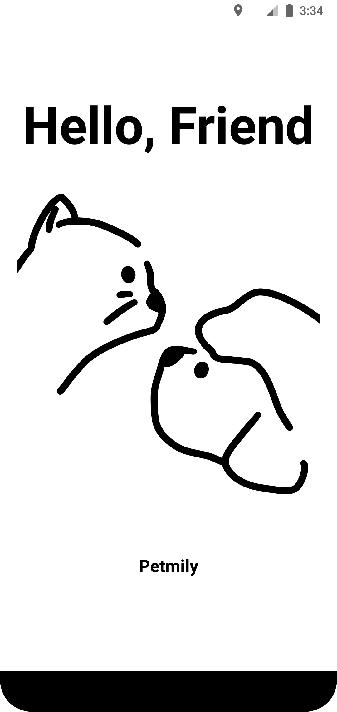
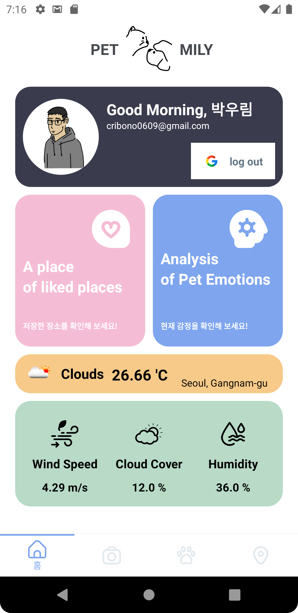
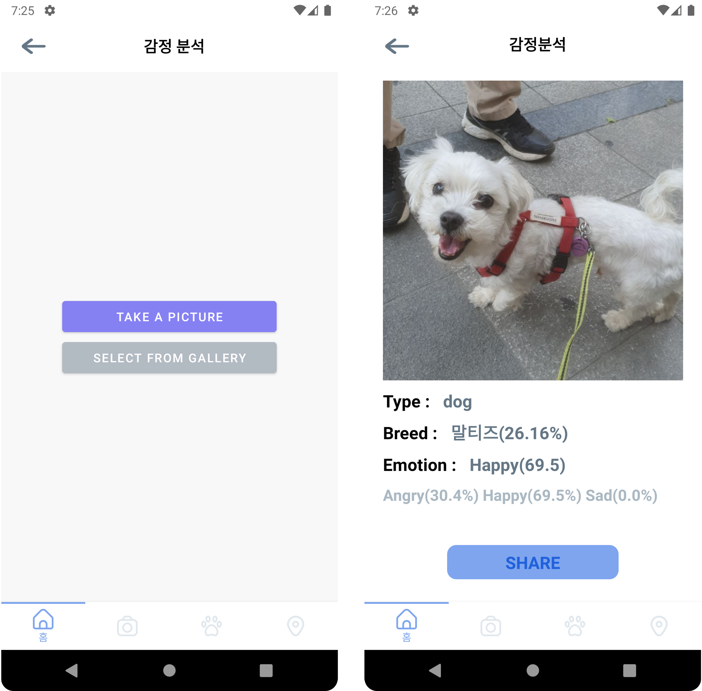
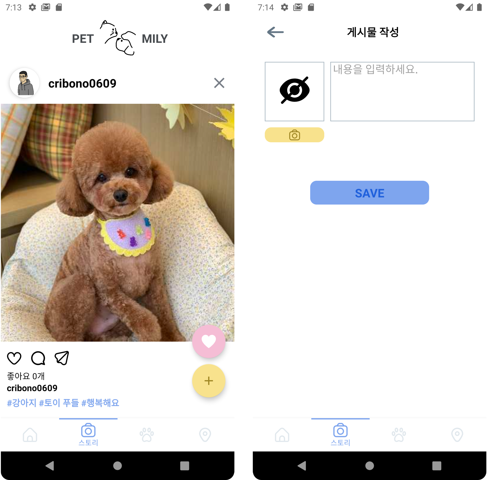
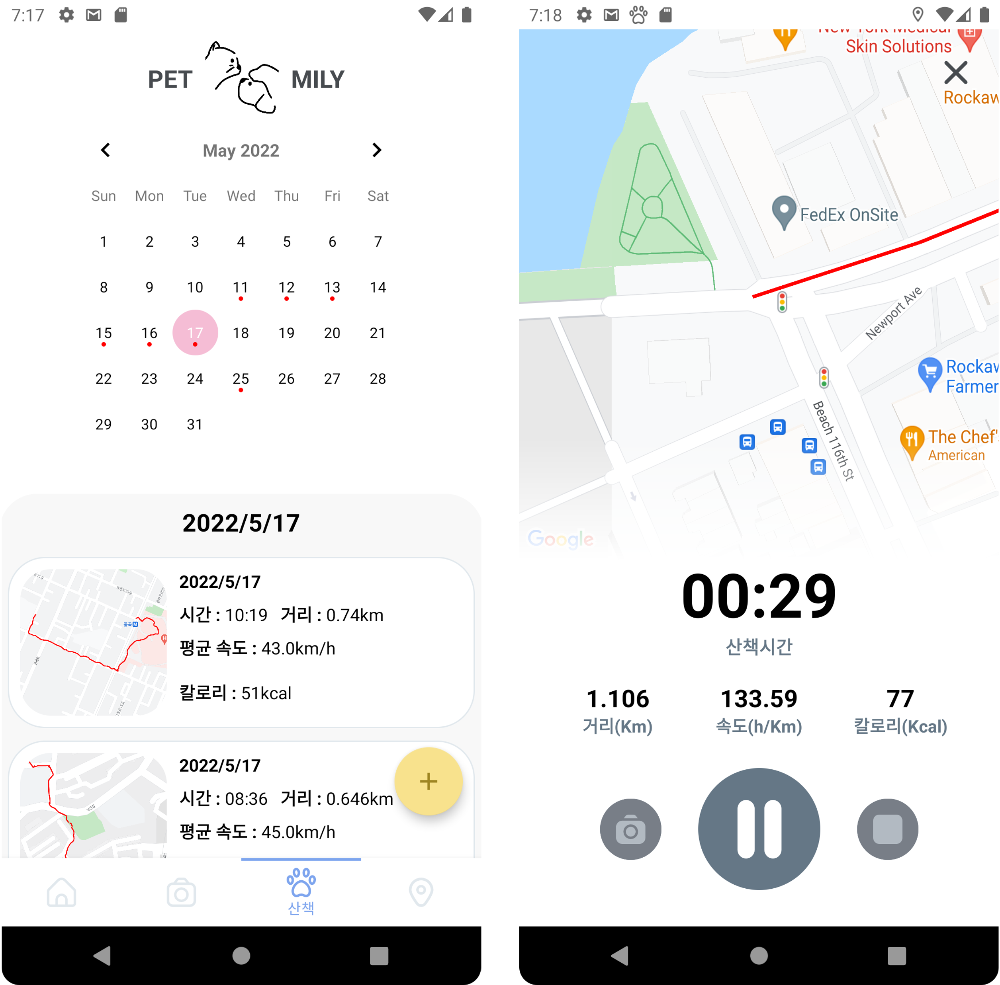
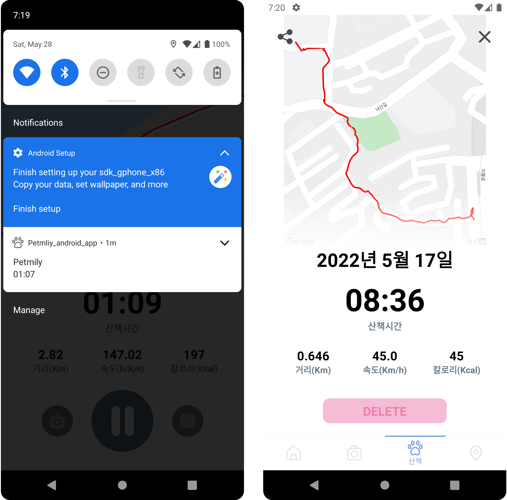
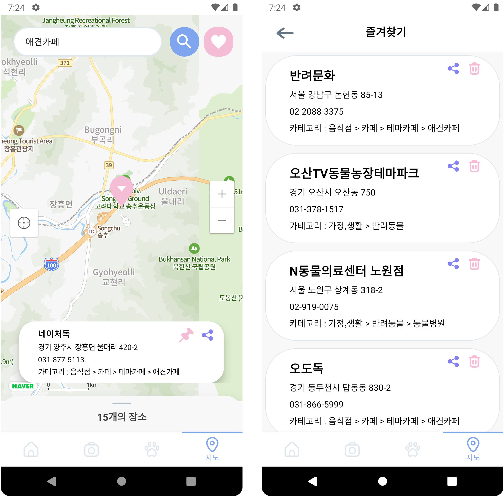

# 3. 기능 구현
##   각 액티비티 기능 설명
//
|  클래스              | 기능                     |layout                         |
|----------------|-------------------------------|-----------------------------|
|Home            |  구글 로그인, 날씨              |fragment_home.xml               |
|Analysis        |동물 감정 분석                   |fragment_analysis.xml           |
|		         |동물 감정 분석 결과              |fragment_result.xml           |
|BookMark        |즐겨 찾기 장소 보기               |fragment_likeplace.xml       |
|Post            |게시물 보기                       |fragment_post.xml             |
|                |게시물 업로드                    |fragment_upload.xml             |
|                |좋아요 한 게시물 보기             |fragment_post_like.xml       |
|                |댓글 보기                        |fragment_comment.xml       |
|Walk            |날짜별 산책 기록 보기             |fragment_walk.xml           |
|                |산책 기록 자세히 보기             |fragment_detail_tracking.xml     |
|                |산책 시작 후 트래킹 모드           |fragment_tracking.xml        |
|Map             |장소 검색                        |fragment_map.xml   |

## 로딩 화면

어플이 실행 되면 가장 먼저 보여지는 화면이다.



#### splashActivity.kt

Handler 를 이용해 2초의 딜레이 진행 뒤에야 MainActivity 화면으로 전환 된다.

```kotlin
Handler(Looper.getMainLooper()).postDelayed({  
	val intent =  
		Intent(baseContext, MainActivity::class.java)  
	    startActivity (intent)  
	    finish()  
    }, 2000)
```

## 메인 화면
#### MainActivity.kt

BottomNavigationView를 이용해 하단 탭으로 화면을 이동한다.
총 4개의 화면으로 구성되어 있으며 초기 화면은 HomeFragment으로 설정되어 있다.

```kotlin
bottomNavigationView.setOnItemSelectedListener { item ->  
  val account = GoogleSignIn.getLastSignedInAccount(this)  
    if(account != null) {  
        when (item.itemId) {  
            R.id.home -> navController.navigate(R.id.homeFragment)  
            R.id.story -> navController.navigate(R.id.postFragment)  
            R.id.walk -> navController.navigate(R.id.walkFragment)  
            R.id.map -> navController.navigate(R.id.mapFragment)  
        }  
        true  
  } else {  
        Toast.makeText(this,"로그인후 이용해주세요",Toast.LENGTH_SHORT).show()  
        true  
  }  
}
```

## 홈 화면
#### HomeFragment.kt


### 로그인
로그인 방법은 구글 로그인이다.
만약 로그인이 되어 있지 않다면 버튼을 누르더라도 홈 화면이 아닌 다른 화면으로 넘어가지 못한다.

#### 구글 로그인

```kotlin
 private fun handleSignInResult(completedTask: Task<GoogleSignInAccount>) {  
        try {  
            val account = completedTask.getResult(ApiException::class.java)  
  updateUI(account)  
        } catch (e: ApiException) {  
            Log.w("Google", "signInResult:failed code=" + e.statusCode)  
            updateUI(null)  
        }  
    }
    
    private fun googleSet() {  
    val gso = GoogleSignInOptions.Builder(GoogleSignInOptions.DEFAULT_SIGN_IN)  
        .requestEmail()  
        .build()  
  
    mGoogleSignInClient = GoogleSignIn.getClient(requireActivity(), gso)  
}
```
### 날씨
OpenWeatherMap API에서 Retrofit을 이용해 날씨 상태를 받아와 실시간으로 보여준다.
현재 온도, 바람, 구름, 습도를 확인할 수 있다.

#### WeatherAPIClient.kt
```kotlin
object WeatherAPIClient {  
    fun getClient(url: String): Retrofit {  
        val okHttpClient: OkHttpClient = OkHttpClient.Builder().addInterceptor(CookiesIntercepter())  
            .addNetworkInterceptor(CookiesIntercepter()).build()  
  
        val retrofit: Retrofit = Retrofit.Builder().baseUrl(url)  
            .addConverterFactory(GsonConverterFactory.create())  
            .client(okHttpClient)  
            .build()  
  
        return retrofit  
    }  
}
```
#### WeatherAPIService.kt
```kotlin
@GET("data/2.5/{path}")  
fun doGetJsonDataWeather(  
    @Path("path") path: String,  
	@Query("q") q: String,  
	@Query("appid") appid: String,  
): Call<WeatherModel>
```

#### RemoteDataSourceImpl.kt
```kotlin
override fun getWeatherInfo(  
    jsonObject: JSONObject,  
	onResponse: (Response<WeatherModel>) -> Unit,  
	onFailure: (Throwable) -> Unit  
	) {  
    val APIService: WeatherAPIService = WeatherAPIClient.getClient(  
        jsonObject.get("url").toString()  
		).create(WeatherAPIService::class.java)  
		APIService.doGetJsonDataWeather(  
	        jsonObject.get("path").toString(),  
			jsonObject.get("q").toString(),  
			jsonObject.get("appid").toString()  
		).enqueue(object :  
        Callback<WeatherModel> {  
        override fun onResponse(call: Call<WeatherModel>, response: Response<WeatherModel>) {  
            onResponse(response)  
        }  
        override fun onFailure(call: Call<WeatherModel>, t: Throwable) {  
            onFailure(t)  
        }  
    }  
    )  
}
```

#### HomeFragment.kt 날씨 띄우기

```kotlin
private fun initWeatherView() {  
    viewModel = ViewModelProvider(this).get(WeatherViewModel::class.java)  
    var jsonObject = JSONObject()  
    jsonObject.put("url", getString(R.string.weather_url))  
    jsonObject.put("path", "weather")  
    jsonObject.put("q", "Seoul")  
    jsonObject.put("appid", getString(R.string.weather_app_id))  
    viewModel.getWeatherInfoView(jsonObject)  
}

private fun observeData() {  
    viewModel.isSuccWeather.observe(  
        viewLifecycleOwner, Observer { it ->  
			if (it) {  
                viewModel.responseWeather.observe(  
                    viewLifecycleOwner, Observer { setWeatherData(it) }  
                )  
			}  
		}  
	)  
}  
  
private fun setWeatherData(model: WeatherModel) {  
    val temp = model.main.temp!!.toDouble() - 273.15  
	val weatherImgUrl = "http://openweathermap.org/img/w/" + model.weather[0].icon + ".png"  
	binding.currentTemp.text =  
        StringBuilder().append(String.format("%.2f", temp)).append(" 'C").toString()  
    binding.currentMain.text = model.weather[0].main  
	binding.windSpeed.text = StringBuilder().append(model.wind.speed).append(" m/s").toString()  
    binding.cloudCover.text = StringBuilder().append(model.clouds.all).append(" %").toString()  
    binding.humidity.text = StringBuilder().append(model.main.humidity).append(" %").toString()  
    Glide.with(this).load(weatherImgUrl).into(binding.weatherImg)  
}
```
```kotlin
override fun onViewCreated(view: View, savedInstanceState: Bundle?) {  
    super.onViewCreated(view, savedInstanceState)
    ''''
    initWeatherView()
    observeData() 
}
```
## 동물 감정 분석

개, 고양이가 있는 사진을 선택하고 전송하여 감정 분석 값을 받아볼 수 있다.
* 사진을 앨범에서 고르거나 카메라로 찍어서 전송한다.
* 로딩 시간이 흐른 후 결과를 받아온다.
* 결과 값은 개, 고양이의 종과 화남, 행복, 슬픔의 감정을 퍼센트로 보내준다.



#### AnalysisFragment.kt

앨범, 카메라 접근 권한이 있는지 확인한다.
```kotlin
private fun getPermissions() {  
    if (ContextCompat.checkSelfPermission(  
	    requireContext(),  
		Manifest.permission.CAMERA  
	)  
		!= PackageManager.PERMISSION_GRANTED &&  
        ContextCompat.checkSelfPermission(  
            requireContext(),  
			Manifest.permission.WRITE_EXTERNAL_STORAGE  
	)  
        != PackageManager.PERMISSION_GRANTED &&  
        ContextCompat.checkSelfPermission(  
            requireContext(),  
			Manifest.permission.READ_EXTERNAL_STORAGE  
	)  
        != PackageManager.PERMISSION_GRANTED  
  ) {  
        ActivityCompat.requestPermissions(  
            requireActivity(),  
			PERMISSIONS,  
			PERMISSIONS_REQUEST  
		)  
    }  
}
```

앨범 또는 카메라를 선택한다. 
다음 ResultFragment 에서 무엇을 선택했는지 알기 위해 navArgs을 이용한다.
```kotlin
override fun onViewCreated(view: View, savedInstanceState: Bundle?) {  
    super.onViewCreated(view, savedInstanceState)  
    getPermissions()  
    binding.takePicture.setOnClickListener {  
    var action = AnalysisFragmentDirections.actionAlbumFragmentToResultFragment(1) //앨범 선택 1
    findNavController().navigate(action)  
    } 
    binding.selectPicture.setOnClickListener {  
    var action = AnalysisFragmentDirections.actionAlbumFragmentToResultFragment(2) //카메라 선택 2
    findNavController().navigate(action)  
    }  
}
```

#### ResultFragment.kt

사진을 서버로 전송하기 위해 Retrofit을 이용한다.
```kotlin
override fun onViewCreated(view: View, savedInstanceState: Bundle?) {  
    super.onViewCreated(view, savedInstanceState)  
    val analyArgs by navArgs<ResultFragmentArgs>()  
	val seletNum: Int = analyArgs.selectNum
    var gson = GsonBuilder().setLenient().create()  
    val retrofit = Retrofit.Builder()  
        .baseUrl("http://ec2-54-180-166-236.ap-northeast-2.compute.amazonaws.com:8080/")  
        .client(client)  
        .addConverterFactory(GsonConverterFactory.create(gson))  
        .build()  
    analysisApi = retrofit.create(AnalysisService::class.java)  
    if (seletNum == 1) {  
	    openCamera()  
	} else {  
	    openGallery()  
	}
}
```
감정 분석 리턴 값을 생성한다.
```kotlin
class AnalysisResult(  
    val type: String, val cropPosition: CropPosition, val breed: Breed, val emotion: Emotion  
)
class CropPosition(  
    val leftX: Int, val leftY: Int, val rightX: Int, val rightY: Int  
)  
class Emotion(  
    val angry: Float, val sad: Float, val happy: Float  
)  
class Breed(  
    val top1: String, val top1_result: Float  
)
```
감정 분석 Retrofit Api을 생성한다.
```kotlin
interface AnalysisService {  
	@Multipart  
	@POST("api/analysis/emotion")  
    fun getEmotion(  
        @Part img: MultipartBody.Part  
    ): Call<AnalysisResult>  
}
```
앨범을 열어 사진을 선택 후 전송한다.
```kotlin
private val imagePickerLauncher =  
    registerForActivityResult(ActivityResultContracts.StartActivityForResult()) {  
		val petImageUri = it.data?.data  
		Glide.with(this).load(petImageUri).centerCrop().into(binding.petImg)  
	    petImageUri?.let { it1 -> getEmotion(it1) }  
	    }
	    
private fun openGallery() {  
    imagePickerLauncher.launch(  
      Intent.createChooser(Intent(Intent.ACTION_GET_CONTENT).apply {  
	  type = "image/*"  
	  }, "사진 선택하기")  
    )  
}
```
카메라로 사진을 찍고 전송한다.
```kotlin
private fun openCamera() {  
    var petImageUri: Uri? = null  
	resultLauncher =  
        registerForActivityResult(ActivityResultContracts.StartActivityForResult()) {  
	        if (it.resultCode == RESULT_OK) {  
                val option = BitmapFactory.Options()  
                option.inSampleSize = 10  
                val bitmap = BitmapFactory.decodeFile(filePath, option)  
                Glide.with(this).load(petImageUri).centerCrop().into(binding.petImg)  
                petImageUri?.let { it1 -> getEmotion(it1) }  
                }  
             }  
	val filename = "${System.currentTimeMillis()}.jpeg"  
	val storageDir: File? =  
        (activity as MainActivity).getExternalFilesDir(Environment.DIRECTORY_PICTURES)  
  
    val file = File.createTempFile(filename, ".jpeg", storageDir)  
    filePath = file.absolutePath  
    petImageUri = FileProvider.getUriForFile(  
        activity as MainActivity,  
		"com.bagooni.petmliy_android_app",  
		file  
	)  
    val intent = Intent(MediaStore.ACTION_IMAGE_CAPTURE)  
    intent.putExtra(MediaStore.EXTRA_OUTPUT, petImageUri)  
    resultLauncher.launch(intent)  
}
```
서버로 사진을 post하고 감정 분석을 받아온다.
```kotlin
private fun getEmotion(petImgUri: Uri) {  
        val bitmap = petImgUri?.let { it1 -> loadBitmapFromMediaStoreBy(it1) }  
        val uploadFile = bitmapToRequestBody("img", bitmap)  
        val loading = LoadingDialog(activity as MainActivity)  
        loading.show()  
  
        analysisApi.getEmotion(uploadFile).enqueue(object : Callback<AnalysisResult> {  
            override fun onResponse(  
                call: Call<AnalysisResult>,  
                response: Response<AnalysisResult>  
            ) {  
                if (response.isSuccessful) {  
                    Log.d("response",response.body().toString())  
                    val result = response.body()  
                    result?.let { updateUI(it) }  
                    loading.dismiss()
                    }else{  
                    Toast.makeText(activity as MainActivity,"동물 사진이 아닙니다.",
                    Toast.LENGTH_SHORT).show()  
                    findNavController().navigate(R.id.albumFragment)  
                    loading.dismiss()  
                }  
            }  
            override fun onFailure(call: Call<AnalysisResult>, t: Throwable) {  
                Log.d("onFailure",t.message.toString())  
                Toast.makeText(activity as MainActivity,"동물 사진이 아닙니다.", Toast.LENGTH_SHORT).show()  
                findNavController().navigate(R.id.albumFragment)  
                loading.dismiss()  
            }  
        })  
    }
``` 
받아온 감정 분석 정보를 화면 UI에 업데이트한다.
```kotlin
private fun updateUI(result: AnalysisResult){  
    binding.petType.text = result.type  
    binding.petBreed.text = StringBuilder().append(result.breed.top1)  
        .append("(")  
        .append(String.format("%.2f", result.breed.top1_result))  
        .append("%)")  
  
    var emotionMap = HashMap<String, Float>()  
    emotionMap["Angry"] = result.emotion.angry  
    emotionMap["Happy"] = result.emotion.happy  
    emotionMap["Sad"] = result.emotion.sad  

	val maxValue = Collections.max(emotionMap.values)
	//퍼센트 값이 가장 큰 감정 찾기 
    emotionMap.entries.stream().forEach { entry ->  
		if (entry.value == maxValue) {  
            binding.petEmotion.text = StringBuilder().append(entry.key)  
                .append("(").append(entry.value).append(")")  
        }  
    } 
	binding.petEmotionSet.text = StringBuilder()  
        .append("Angry(").append(emotionMap["Angry"]).append("%) ")  
        .append("Happy(").append(emotionMap["Happy"]).append("%) ")  
        .append("Sad(").append(emotionMap["Sad"]).append("%)")  
}
```
## 커뮤니티
자신의 반려 동물 사진을 올리고 여러 사람들과 소통하며 공유할 수 있다.
* 강아지, 고양이 사진만 업로드할 수 있다.
* 자동으로 태그를 달아준다. (종 분류, 감정 분석)
* 게시물마다 좋아요, 댓글, 공유를 할 수 있다.
* 자신이 '좋아요'한 게시물을 모아볼 수 있다.



### 게시물 가져오기
#### PostFragment.kt
게시물을 서버로부터 받아오기 위해 Retrofit을 이용한다.
```kotlin
override fun onViewCreated(view: View, savedInstanceState: Bundle?) {  
    super.onViewCreated(view, savedInstanceState)
    val feedListView = view.findViewById<RecyclerView>(R.id.feedList)  
	var gson = GsonBuilder().setLenient().create()  
    val retrofit = Retrofit.Builder()  
        .baseUrl("http://ec2-54-180-166-236.ap-northeast-2.compute.amazonaws.com:8080/")  
        .client(client)  
        .addConverterFactory(GsonConverterFactory.create(gson))  
        .build()  
    retrofitService = retrofit.create(RetrofitService::class.java)
```
#### RetrofitService
게시물 받아오는 데이터 모델과 인터페이스를 생성한다.
```kotlin
class Post(  
    val postId: Long, val userImg: String, val email: String, val postImg: String,  
    val postContent: String, val tags: String  
)
interface RetrofitService {   
    //포스트 가져오기  
  @GET("api/post/findAll")  
    fun getPost(  
    ): Call<ArrayList<Post>>   
}
```
게시물은 RecyclerView와 Adapter로 구성한다.
```kotlin
class PostRecyclerViewAdapter(  
    val postList: ArrayList<Post>,  
	val inflater: LayoutInflater,  
	val glide: RequestManager,  
	val postFragment: PostFragment,  
	val activity: MainActivity,  
	val shareButton: (String) -> Unit  
) : RecyclerView.Adapter<PostRecyclerViewAdapter.ViewHolder>() {

	inner class ViewHolder(itemView: View) : RecyclerView.ViewHolder(itemView) {  
	    val userImg: ImageView  
	    val userName: TextView
	    ...
	    init {  //itemView와 연결
		    userImg = itemView.findViewById(R.id.userImg)  
		    userName = itemView.findViewById(R.id.userEmail)
		    ...
		}
	}
	override fun onCreateViewHolder(parent: ViewGroup, viewType: Int): ViewHolder {  
	    return ViewHolder(inflater.inflate(R.layout.post_recyclerview_item, parent, false))  
    }
    override fun onBindViewHolder(holder: ViewHolder, position: Int) {  
	    val post = postList[position]
	    ...
	}
}
```
#### 게시물 가져오기 getPost
인터페이스 getPost 함수를 이용해 서버에서 게시물을 받아온다.
```kotlin
private fun getPost() {  
    val loading = LoadingDialog(activity as MainActivity)  
    loading.show()  
    retrofitService.getPost().enqueue(object : Callback<ArrayList<Post>> {  
        override fun onResponse(  
            call: Call<ArrayList<Post>>,  
			response: Response<ArrayList<Post>>  
        ) {  
            val postList = response.body()  
            val postRecyclerView = view?.findViewById<RecyclerView>(R.id.feedList)  
            postRecyclerView?.adapter = postList?.let {  PostRecyclerViewAdapter(  
                    it,  
                    LayoutInflater.from(activity),  
                    Glide.with(activity!!),  
                    this@PostFragment,  
                    activity as (MainActivity),  
                    shareButton = {
                        val bytes = Base64.decode(it, Base64.DEFAULT)  
                        val changeImg = BitmapFactory.decodeByteArray(bytes, 0, bytes.size)  
                        bitmapToUri(changeImg)  
                    }  
	             )  
             }  
        }  
  
        override fun onFailure(call: Call<ArrayList<Post>>, t: Throwable) {  
            Log.d("log", t.message.toString())  
        }  
    })  
}
```
Retrofit 응답 객체(Response<ArrayList<Post>>)를 받고 adapter로 RecyclerView에 item과 각각 연결한다.
```kotlin
override fun onBindViewHolder(holder: ViewHolder, position: Int) {  
    val post = postList[position]  
  
    post.userImg.let {  glide.load(it).centerCrop().circleCrop().into(holder.userImg) }  
  
	if (post.postImg.isNotEmpty()) {  
        val byte = Base64.decode(post.postImg, Base64.DEFAULT)  
        val img: Bitmap = BitmapFactory.decodeByteArray(byte, 0, byte.size)  
        holder.postImg.setImageBitmap(img)  
    }  
    holder.postUserName.text = post.email.split("@")[0]  
    holder.userName.text = post.email.split("@")[0]  
    holder.postContent.text = post.postContent  
    //자동 태그
    ("#" + post.tags.replace(", ", " #")).also { holder.tagText.text = it }  
  
	if (post.email == postFragment.personEmailInput) {  
        holder.deleteBtn.visibility = VISIBLE  
	}  
}
```
### 게시물 작성
자신의 반려 동물 사진을 올려 다른 사람들과 공유할 수 있다.
* 개, 고양이가 없는 사진은 업로드할 수 없다.
#### PostUploadFragment.kt
앨범 속 사진이나 카메라로 찍은 사진과 짧을 글을 써서 게시물을 작성하는 화면이다.
* 감정 분석에 있는 imagePickerLauncher, cameraLauncher을 사용해서 사진을 선택한 후 똑같이 RequestBody로 바꾼다.
#### postUpload
게시물 내용을 서버에 전송하는 함수이다.
개, 고양이 사진이 없는 경우 Toast 실패 메세지를 출력하고 전송에 성공하면 Toast 성공 메세지 출력 후 포스트 화면으로 이동한다.
```kotlin
private fun postUpload(postImageUri: Uri) {  
    var gson = GsonBuilder().setLenient().create()  
    val retrofit = Retrofit.Builder()  
        .baseUrl("http://ec2-54-180-166-236.ap-northeast-2.compute.amazonaws.com:8080/")  
        .client(client)  
        .addConverterFactory(GsonConverterFactory.create(gson))  
        .build()  
    val retrofitService = retrofit.create(RetrofitService::class.java)  
  
    //입력문구 얻어옴  
	contentInput = binding.postContent.text.toString()
	//로딩화면
    val loading = LoadingDialog(activity as MainActivity)  
    loading.show()
    //게시글 내용
    val postContent = MultipartBody.Part.createFormData("postContent", contentInput)
    //유저 이미지
    val userUploadFile = MultipartBody.Part.createFormData("userImg", userImgUri)  
    //게시글 사진을 비트맵으로 변환
    val bitmap = postImageUri?.let { it1 -> loadBitmapFromMediaStoreBy(it1) }
    //비트맵으로 변환한 사진을 requestBody로 변환 
    val uploadFile = bitmapToRequestBody("postImg", bitmap)  
  
    if (uploadFile != null) {  
        retrofitService.postUpload(personEmailInput, uploadFile, postContent, userUploadFile)  
            .enqueue(object : Callback<Post> {  
                override fun onResponse(call: Call<Post>, response: Response<Post>) {  
                    if (response.isSuccessful) {
                        Log.d("log", response.toString())  
                    } else {
	                    //개, 고양이 사진이 아닐 경우 
                        Toast.makeText(  
                            activity as MainActivity, "동물 사진이 아닙니다.", Toast.LENGTH_SHORT).show()  
                        findNavController().navigate(R.id.postUploadFragment)  
                        loading.dismiss()  //로딩화면 멈추기
                    }  
                }  
                override fun onFailure(call: Call<Post>, t: Throwable) { 
                    Toast.makeText(activity as MainActivity, "포스트 업로드했습니다.", Toast.LENGTH_SHORT)  
                        .show()  
                    findNavController().navigate(R.id.postFragment)  
                    loading.dismiss()  
                }  
            })  
    }  
  
}
```
### 게시물 삭제
#### RetrofitService
```kotlin
interface RetrofitService {
	@DELETE("api/post/delete/{postId}")  
	fun deletePost(  
	    @Header("email") email: String,  
		@Path("postId") postId: Long  
	): Call<Void>
}
```
본인 이메일로 올린 게시물만 삭제 버튼을 볼 수 있고 버튼 클릭 시 확인 dialog 뜨고 삭제된다.
```kotlin
override fun onBindViewHolder(holder: ViewHolder, position: Int) {
	...
	holder.deleteBtn.setOnClickListener {  
		val builder = AlertDialog.Builder(activity as MainActivity)  
		builder.setTitle("게시글을 삭제하시겠습니까?")  
	        .setMessage("업로드한 게시글이 삭제됩니다.")  
	        .setPositiveButton("확인", DialogInterface.OnClickListener{ dialog, id ->  
		Thread {  
			activity.runOnUiThread {  
				postFragment.deletePost(post.postId)  
				Thread.sleep(1000)  
				Toast.makeText( activity as MainActivity, "게시글이 삭제되었습니다.", Toast.LENGTH_SHORT).show()  
				postFragment.getPost()  //새로고침
			}  
		}.start()  
		})  
        .setNegativeButton("취소", DialogInterface.OnClickListener{ dialog, id ->  })  
	    builder.show()  
	}
}
```
#### 게시물 삭제 deletePost
```kotlin
private fun deletePost(postId: Long) {  
    retrofitService.deletePost(personEmailInput, postId).enqueue(object : Callback<Void> {  
        override fun onResponse(call: Call<Void>, response: Response<Void>) {  
        }  
        override fun onFailure(call: Call<Void>, t: Throwable) {  
            Log.d("log delete", t.message.toString())  
        }  
    })  
}
```
### 좋아요
게시물을 구경하다 마음에 드는 게시물에 '좋아요'로 공감할 수 있다.
* 좋아요 누른 게시물은 분홍색 하트로 표현되고 누르지 않은 게시물은 투명 하트로 표시한다.
* 몇 명이 '좋아요'를 눌렀는지 표시한다.
* 하트 버튼을 누름으로써 '좋아요' 또는 '좋아요'를 취소할 수 있다.
* '좋아요' 한 게시물 모아보기
#### PostLikeFragment.kt
* 모든 게시물은 원래 투명 하트로 표시하고 클릭 시 분홍 하트로 바뀌고 이미지 위에 하얀 하트가 1초 동안 보일 수 있도록 한다.
* 바로 화면을 바꾸고 순서대로 진행하기 위해 쓰레드를 이용한다.
```kotlin
class PostRecyclerViewAdapter(  
    val postList: ArrayList<Post>, 
    ...
) : RecyclerView.Adapter<PostRecyclerViewAdapter.ViewHolder>() {  
  
    inner class ViewHolder(itemView: View) : RecyclerView.ViewHolder(itemView) {  
        ... 
        val favoriteBtn: ImageButton  
        val favoriteColorBtn: ImageButton  
        ...
  
        init {  
            ...
            favoriteBtn = itemView.findViewById(R.id.favoriteBtn) //좋아요 버튼  
			favoriteColorBtn = itemView.findViewById(R.id.favoriteColorBtn) //좋아요 색 버튼  
            postLayer = itemView.findViewById(R.id.postLayer)  //사진 하얀 배경  
			postHeart = itemView.findViewById(R.id.postHeart)  //사진 위 하얀 하트
            countLike = itemView.findViewById(R.id.likeCount)  //좋아요 개수 
            ...
  
            favoriteBtn.setOnClickListener {  
				Thread {  
					postFragment.postLike(postList[adapterPosition].postId)  
					activity.runOnUiThread {  
	                    favoriteColorBtn.visibility = VISIBLE  //분홍 하트 표시
	                    postLayer.visibility = VISIBLE  
	                    postHeart.visibility = VISIBLE  
	                }  
					Thread.sleep(1000)  //1초간 쉼
					activity.runOnUiThread { 
	                    postLayer.visibility = INVISIBLE  
	                    postHeart.visibility = INVISIBLE  
	                    postFragment.getCountLike(postList[adapterPosition].postId, countLike)  //좋아요 개수 업데이트
	                }  
	            }.start()  
			}  
  
			favoriteColorBtn.setOnClickListener {  
				Thread {  
					activity.runOnUiThread {  
					postFragment.deleteData(postList[adapterPosition].postId)  //좋아요 취소
					favoriteColorBtn.visibility = INVISIBLE  
					}  
					Thread.sleep(1000)  
                    activity.runOnUiThread {  
                    postFragment.getCountLike(postList[adapterPosition].postId, countLike) //좋아요 개수 업데이트 
                    }  
                }.start()  
			}  
		}  
	}
```
#### LikeRetrofitService
```kotlin
class Like(  
    val postId: Long, val userImg: String  
)  
  
interface LikeRetrofitService {  
    @POST("api/like/save")  
    fun postLike(  
        @Header("email") email: String,  
		@Query("postId") postId: Long,  
		@Query("userImg") userImg: String  
    ): Call<Like>  
  
    @DELETE("api/like/delete/{postId}")  
    fun deleteLike(  
        @Header("email") email: String,  
		@Path("postId") postId: Long  
    ): Call<Void>  
  
    @GET("api/like/aboutMyLike/{postId}")  
    fun aboutLike(  
        @Header("email") email: String,  
		@Path("postId") postId: Long  
    ): Call<Int>  
  
    @GET("api/like/count/{postId}")  
    fun countLike(  
        @Path("postId") postId: Long  
    ): Call<Int>  
}
```
#### 좋아요 표시 postLike
```kotlin
private fun postLike(postId: Long) {  
    likeRetrofitService.postLike(personEmailInput, postId, userImgUri)  
        .enqueue(object : Callback<Like> {  
            override fun onResponse(call: Call<Like>, response: Response<Like>) {  
            }  
            override fun onFailure(call: Call<Like>, t: Throwable) {  
            }
        })  
}
```
#### 좋아요 삭제 deleteData
```kotlin
private fun deleteData(postId: Long) {  
    likeRetrofitService.deleteLike(personEmailInput, postId).enqueue(object : Callback<Void> {  
        override fun onResponse(call: Call<Void>, response: Response<Void>) {  
        }  
        override fun onFailure(call: Call<Void>, t: Throwable) {  
            Log.d("log", t.message.toString())  
        }  
    })  
}
```
#### 좋아요 개수 getCountLike
```kotlin
private fun getCountLike(postId: Long, textView: TextView) {  
    likeRetrofitService.countLike(postId).enqueue(object : Callback<Int> {  
        override fun onResponse(call: Call<Int>, response: Response<Int>) {  
            ("좋아요 " + response.body().toString() + "개").also { textView.text = it }  
        } 
        override fun onFailure(call: Call<Int>, t: Throwable) {  
        }  
    })  
}
```
#### 좋아요 했는지 확인 aboutLike
```kotlin
override fun onBindViewHolder(holder: ViewHolder, position: Int) {
    ...
    postFragment.likeRetrofitService.aboutLike(postFragment.personEmailInput, post.postId)  
    .enqueue(object : Callback<Int> {  
        override fun onResponse(call: Call<Int>, response: Response<Int>) {  
            Log.d("getPostLike", response.body().toString())  
            if (response.body() == 1) {  //좋아요 했을 경우 1 리턴
                holder.favoriteColorBtn.visibility = VISIBLE  
            } else {  
                holder.favoriteColorBtn.visibility = INVISIBLE  
                }  
        }  
        override fun onFailure(call: Call<Int>, t: Throwable) {  
        }  
    })
}
```

### 좋아요 모아보기
#### RetrofitService
```kotlin
interface RetrofitService {
	//좋아요 누른 게시물  
	@GET("api/post/findAllLike")  
	fun getLikePost(  
	    @Header("email") email:String,  
	): Call<ArrayList<Post>>
}
```
#### PostUploadFragment.kt
PostFragment에서 getLikePost 사용하여 '좋아요'한 게시물만 모아보도록 한다.
```kotlin
private fun getLikePost(){  
    //로딩 화면  
	val loading = LoadingDialog(activity as MainActivity)  
    loading.show()  
    retrofitService.getLikePost(personEmailInput).enqueue(object : Callback<ArrayList<Post>>{  
        override fun onResponse(call: Call<ArrayList<Post>>, response: Response<ArrayList<Post>>) {  
            val postList = response.body()  
            val likeRecyclerView = view?.findViewById<RecyclerView>(R.id.likeList)  
            likeRecyclerView?.adapter = postList?.let{ LikeRecyclerViewAdapter(  
				it,  
				LayoutInflater.from(activity),  
				Glide.with(activity!!),  
				this@PostLikeFragment,  
				activity as (MainActivity)  
			)}  
			loading.dismiss() //로딩 화면 멈추기  
		}  
        override fun onFailure(call: Call<ArrayList<Post>>, t: Throwable) {  
            Log.d("log",t.message.toString())  
        }  
    })  
}
```

### 댓글
게시물에 댓글을 달아 글 쓴 사람과 직접 소통할 수 있다.
#### 해당 댓글 화면으로 이동 postToComment
게시물 댓글 버튼을 클릭하면 그 게시물 id을 CommentFragment로 전달해서 해당 게시물의 댓글을 보여준다.
```kotlin
override fun onBindViewHolder(holder: ViewHolder, position: Int) {
	...
	holder.commentBtn.setOnClickListener { postFragment.postToComment(post.postId) }
}

fun postToComment(postId: Long) {  
    var action = PostFragmentDirections.actionPostFragmentToCommentFragment(postId)  
    findNavController().navigate(action)  
}
```
#### CommentFragment.kt
전달 받은 게시물 id을 저장하고 retrofit 연결해 댓글을 불러오고 새로 입력할 수 있다.
```kotlin
override fun onViewCreated(view: View, savedInstanceState: Bundle?) {  
    super.onViewCreated(view, savedInstanceState)  
    //postId 전달 받음  
	val commentArgs by navArgs<CommentFragmentArgs>()  
    val inputPostId: Long = commentArgs.postId  
	//구글 로그인 정보  
	checkSign()  
    //retrofit 연결  
	val CommentListView = view.findViewById<RecyclerView>(R.id.commentList)  
    val retrofit = Retrofit.Builder()  
        .baseUrl("http://ec2-54-180-166-236.ap-northeast-2.compute.amazonaws.com:8080/")  
        .client(client)  
        .addConverterFactory(GsonConverterFactory.create())  
        .build()  
    commentRetrofitService = retrofit.create(CommentRetrofitService::class.java)  
    //해당 postId 댓글 불러오기  
	commentGet(inputPostId)  
    //댓글 입력  
	binding.uploadButton.setOnClickListener { commentUpload(inputPostId) }  
}
```
#### CommentRetrofitService
```kotlin
class Comment(  
    val postId: Long, val email: String, val commentContent: String, val userImg: String?  
)  
  
interface CommentRetrofitService {  
	//댓글 받기
    @GET("api/comment/findByPostId/{postId}")  
    fun getComment(  
        @Path("postId") postId: Long  
    ): Call<ArrayList<Comment>>  

	//댓글 입력
    @POST("api/comment/save")  
    fun postComment(  
        @Header("email") email: String,  
		@Query("userImg") userImg: String?,  
		@Query("postId") postId: Long,  
		@Query("commentContent") commentContent: String,  
	): Call<Comment>  
}
```
#### 댓글 받아오기 commentGet
```kotlin
private fun commentGet(postId: Long){  
    commentRetrofitService.getComment(postId).enqueue(object : Callback<ArrayList<Comment>>{  
        override fun onResponse(  
            call: Call<ArrayList<Comment>>,  
			response: Response<ArrayList<Comment>>  
        ) {  
            //응답 객체 받기  
			val commentList = response.body()  
            //recyclerView와 연결  
			val commentRecyclerView = view?.findViewById<RecyclerView>(R.id.commentList)  
            commentRecyclerView?.adapter = commentList?.let{ CommentRecyclerViewAdapter(  
                it,  
				LayoutInflater.from(activity),  
				activity as (MainActivity),  
				Glide.with(activity!!)  
			) }  
		}  
        override fun onFailure(call: Call<ArrayList<Comment>>, t: Throwable) {  
            Log.d("log",t.message.toString())  
        }  
    })  
}
```
#### 댓글 입력 commentUpload
```kotlin
private fun commentUpload(postId : Long){  
    //댓글 입력 내용 가져오기  
	commentContent = binding.commentEdit.text.toString()  
    //댓글 post
    commentRetrofitService.postComment(personEmailInput,userImgUri,postId,commentContent)  
        .enqueue(object : Callback<Comment>{  
        override fun onResponse(  
            call: Call<Comment>,  
            response: Response<Comment>  
        ) {  
            Log.d("log", response.body().toString())  
        }  
        override fun onFailure(call: Call<Comment>, t: Throwable) {  
            Log.d("log",t.message.toString())  
        }  
    })  
    //댓글 post 이후  
	binding.commentEdit.text = null //댓글 입력 내용 지우기  
	hideKeyboard()  //키보드 숨기기  
	commentGet(postId)  //댓글 새로고침  
}
```
#### CommentRecyclerViewAdapter
```kotlin
class CommentRecyclerViewAdapter(  
    val commentList: ArrayList<Comment>,  
	val inflater: LayoutInflater,  
	val activity: MainActivity,  
	val glide: RequestManager  
): RecyclerView.Adapter<CommentRecyclerViewAdapter.ViewHolder>(){  
    inner class ViewHolder(itemView: View) : RecyclerView.ViewHolder(itemView){  
        val userEmail : TextView  
        val userImg : ImageView  
        val commentText : TextView  
  
        init {  
            userEmail = itemView.findViewById(R.id.userEmail)  
            userImg = itemView.findViewById(R.id.userImg)  
            commentText = itemView.findViewById(R.id.commentText)  
        }  
    }  
    
    override fun onCreateViewHolder(parent: ViewGroup, viewType: Int): ViewHolder {  
        return ViewHolder(inflater.inflate(R.layout.post_comment_item_detail,parent,false))  
    }  
  
    override fun onBindViewHolder(holder: ViewHolder, position: Int) {  
        val comment = commentList[position]  
        comment.userImg?.let { glide.load(it).centerCrop().circleCrop().into(holder.userImg)}  
        holder.userEmail.text = comment.email.split("@")[0]  
        holder.commentText.text = comment.commentContent  
	}  

    override fun getItemCount(): Int {  
        return commentList.size  
    }  
}
```

## 산책
산책 기록을 저장하고 날짜 별로 확인할 수 있다.
* 실시간으로 산책하는 위치를 지도로 볼 수 있고 경로를 추적하여 저장한다.
* 날짜 별로 산책 기록을 확인, 삭제, 공유가 가능하다


	
	


### 산책 저장 확인
#### WalkFragment.kt
* MaterialCalendarView에 산책 기록이 있는 날은 빨간 점으로 표시한다.
* 날짜를 클릭하면 해당 날의 산책 기록 리스트를 볼 수 있다.
* 산책 기록을 클릭하면 DetailTrackingFragment으로 넘어가고 삭제 및 공유할 수 있다.

처음 화면을 그릴 때 저장된 모든 산책 정보를 서버로부터 받아오고 날짜를 선택하면 해당 날짜에 저장된 산책 기록을 가져와 보여준다.
```kotlin
override fun onViewCreated(view: View, savedInstanceState: Bundle?) {  
    super.onViewCreated(view, savedInstanceState)  
  
    val current = LocalDateTime.now()  
    val formatter = DateTimeFormatter.ofPattern("yyyy/M/d")  
    val formatted = current.format(formatter)  
    view.findViewById<TextView>(R.id.calendarTitle).text = formatted  
  
    val recyclerView = view.findViewById<RecyclerView>(R.id.calendarRecyclerView)  
    recyclerView.adapter = recyclerAdapter  
	recyclerView.layoutManager = LinearLayoutManager(activity).also{  
		it.reverseLayout = true  
		it.stackFromEnd = true  
	}  
    var calendarView = view.findViewById<MaterialCalendarView>(R.id.calendarView)  
  
    calendarView.setSelectedDate(CalendarDay.today())  
    calendarView.setOnDateChangedListener { widget, date, selected ->  
	view.findViewById<TextView>(R.id.calendarTitle).text =  
            "${date.year}/${date.month}/${date.day}"  
	viewModel.trackingSortedByCalendar(date.year, date.month, date.day)  
            .observe(viewLifecycleOwner, Observer {  
				customAPi(date.year, date.month, date.day)  
            })  
    }  
	val calendar = Calendar.getInstance()  
    viewModel.trackingSortedByCalendar(  
        calendar.get(Calendar.YEAR),
		calendar.get(Calendar.MONTH) + 1,  
		calendar.get(Calendar.DAY_OF_MONTH)  
	).observe(viewLifecycleOwner, Observer {  
		allDataAPi(calendarView)  
        customAPi(calendar.get(Calendar.YEAR), calendar.get(Calendar.MONTH) + 1, calendar.get(Calendar.DAY_OF_MONTH))  
    })  
}
```
#### CalendarRecyclerAdapter
해당 날짜의 산책 기록(날짜, 시간, 거리, 평균 속도, 칼로리) 리스트를 보여준다.
```kotlin
class CalendarRecyclerAdapter(val detailRecyclerView: (Tracking) -> Unit) :  
    ListAdapter<Tracking, CalendarRecyclerAdapter.ItemViewHolder>(CalendarRecyclerAdapter.differ) {  
    inner class ItemViewHolder(private val binding: WalkRecycleviewDetailBinding) :  
        RecyclerView.ViewHolder(binding.root) {  
        fun bind(tracking: Tracking) {  
			val trackingImageView = binding.trackingImage  
			trackingImageView.clipToOutline = true  
			val trackingDateTextView = binding.trackingDate  
			val trackingAvgSpeedTextView = binding.trackingAvgSpeed  
			val trackingDistanceTextView = binding.trackingDistance  
			val trackingTimeTextView = binding.trackingTime  
			val trackingCaloriesTextView = binding.trackingCalories 
  
			trackingDateTextView.text = "${tracking.year}/${tracking.month}/${tracking.day}"  
  
			val avgSpeed = "${tracking.avgSpeedInKMH}km/h"  
			trackingAvgSpeedTextView.text = avgSpeed  
  
            val distanceInKm = "${tracking.distanceInMeters / 1000f}km"  
			trackingDistanceTextView.text = distanceInKm  
  
            trackingTimeTextView.text =  
                TrackingUtility.getFormattedStopWatchTime(tracking.timeInMillis)  
  
            val caloriesBurned = "${tracking.caloriesBurned}kcal"  
  trackingCaloriesTextView.text = caloriesBurned  
  
            binding.root.setOnClickListener {  
  detailRecyclerView(tracking)  
            }  
		}  
    }  
  
    override fun onCreateViewHolder(parent: ViewGroup, viewType: Int): ItemViewHolder {  
        return ItemViewHolder(  
            WalkRecycleviewDetailBinding.inflate(  
                LayoutInflater.from(parent.context),  
				parent, false )  
        )  
    }  
  
    override fun onBindViewHolder(holder: ItemViewHolder, position: Int) {  
        holder.bind(currentList[position])  
    }  
  
    override fun getItemCount(): Int {  
        return currentList.size  
  }  
  
    companion object {  
        val differ = object : DiffUtil.ItemCallback<Tracking>() {  
            override fun areItemsTheSame(oldItem: Tracking, newItem: Tracking): Boolean {  
                return oldItem.id == newItem.id  
			}  
            override fun areContentsTheSame(oldItem: Tracking, newItem: Tracking): Boolean {  
                return oldItem.hashCode() == newItem.hashCode()  
            }  
        }  
    }  
}
```
#### Tracking 데이터 모델
```kotlin
@Entity(tableName = TRACKING_DATABASE_NAME)  
@Parcelize  
data class Tracking(  
    @PrimaryKey  
	var id: Int = 0,  
	val year: Int = 0,  
	val month: Int = 0,  
	val day: Int = 0,  
	var img: String? = null, 
	var avgSpeedInKMH: Float = 0f,  
	var distanceInMeters: Int = 0,  
	var timeInMillis: Long = 0L,  
	var caloriesBurned: Int = 0  
) : Parcelable
```
#### CustomWalkApi
```kotlin
interface CustomWalkApi {
	@GET("/api/walk/findByDate/{year}/{month}/{day}")  
	fun searchData(  
	    @Header("email") email: String,  
		@Path("year") year: Int,  
		@Path("month") month: Int,  
		@Path("day") day: Int  
	): Call<List<Tracking>>  
  
	@GET("/api/walk/findAll")  
	fun searchAllData(  
		@Header("email") email: String,  
	): Call<List<Tracking>>
}
```
#### 모든 산책 기록 가져오기 allDataApi
```kotlin
private fun allDataAPi(calendarView: MaterialCalendarView) {  
    val retrofit = Retrofit.Builder()  
        .baseUrl("http://ec2-54-180-166-236.ap-northeast-2.compute.amazonaws.com:8080")  
        .client(client)  
        .addConverterFactory(GsonConverterFactory.create())  
        .build()  
  
    val api = retrofit.create(CustomWalkApi::class.java)  
    val loading = LoadingDialog(activity as MainActivity)  
    loading.show()  
  
    googleEmail?.let { email ->  
		api.searchAllData(email)  
    }?.enqueue(object : Callback<List<Tracking>> {  
        override fun onResponse(  
            call: Call<List<Tracking>>,  
			response: Response<List<Tracking>>  
        ) {  
            response.body().let { dto ->  
			Log.d("Walk", response.body().toString())  
                val r = Runnable {  
					val iterator = dto?.iterator() //날짜 상관없이 모든 데이터 가져오기  
					if (iterator != null) {  
                        while (iterator.hasNext()) {  
                            var item = iterator.next()  
                            var year = item.year;  
							var month = item.month;  
							var day = item.day  
							setDate.add(CalendarDay.from(year, month, day))  
                        }  
                    }  
                    activity?.runOnUiThread {  
					if (calendarView != null) {  
                            calendarView.addDecorator(object : DayViewDecorator {  
                                override fun shouldDecorate(day: CalendarDay?): Boolean {  
                                    return setDate.contains(day)  
                                }  
  
                                override fun decorate(view: DayViewFacade?) {  
                                    view?.addSpan(DotSpan(5f, Color.RED))  
                                }  
                            })  
                        }  
                    }  
				 }  val thread = Thread(r)  
	                thread.start()
			}  
			loading.dismiss()  
        }  
  
        override fun onFailure(call: Call<List<Tracking>>, t: Throwable) {  
            Log.d("walk Error2", t.message.toString())  
        }  
    })  
}
```
#### 해당 날짜에 저장된 산책 기록 가져오기 customAPi searchData
```kotlin
private fun customAPi(year: Int, month: Int, day: Int) {  
    val retrofit = Retrofit.Builder()  
        .baseUrl("http://ec2-54-180-166-236.ap-northeast-2.compute.amazonaws.com:8080")  
        .client(client)  
        .addConverterFactory(GsonConverterFactory.create())  
        .build()  
  
    val api = retrofit.create(CustomWalkApi::class.java)  
  
    googleEmail?.let { email ->  
		api.searchData(email, year, month, day)  
    }?.enqueue(object : Callback<List<Tracking>> {  
        override fun onResponse(  
            call: Call<List<Tracking>>,  
			response: Response<List<Tracking>>  
        ) {  
            response.body().let { dto ->  
				Log.d("Walk", response.body().toString())  
                recyclerAdapter.submitList(dto)  
            }  
		}  
  
        override fun onFailure(call: Call<List<Tracking>>, t: Throwable) {  
            Log.d("walk Error1", t.message.toString())  
        }  
    })  
}
```

### 실시간 산책 기록
산책할 때 실시간으로 산책 시간, 산책 거리, 속도, 칼로리가 기록된다.

WalkFragment에서 추가 버튼 클릭 시 TrackingFragment로 이동한다.
```kotlin
private fun initButtons(view: View) {  
    view.findViewById<FloatingActionButton>(R.id.changeTrackingFragment).setOnClickListener {  
		getPermissions()  
        findNavController().navigate(R.id.action_walkFragment_to_trackingFragment)  
    }  
}
```
#### TrackingFragment.kt
```kotlin
override fun onViewCreated(view: View, savedInstanceState: Bundle?) {  
    super.onViewCreated(view, savedInstanceState)  
  
    mapView = view.findViewById(R.id.googleMapView)  
    mapView.onCreate(savedInstanceState)  
  
    initViews(view)  
    initButtons(view)  
  
    mapView.getMapAsync {  
	map = it  
	addAllPolyLines()  
    }  
  
  subscribeToObservers(view)  
}
private fun initViews(view: View) {  //첫 화면 초기화
    view.findViewById<AppCompatImageButton>(R.id.startButton).visibility = View.VISIBLE  
  view.findViewById<AppCompatImageButton>(R.id.pauseButton).visibility = View.GONE  
}
```
* 각각의 버튼을 클릭했을 때 실행할 액션을 정한다.
```kotlin
private fun initButtons(view: View) {  
    view.findViewById<AppCompatImageButton>(R.id.startButton).setOnClickListener {  //시작 버튼
		if (!isTracking) {  
            sendCommandToService(ACTION_START_OR_RESUME_SERVICE)  
            view.findViewById<AppCompatImageButton>(R.id.startButton).visibility = View.GONE  
			view.findViewById<AppCompatImageButton>(R.id.pauseButton).visibility = View.VISIBLE  
			view.findViewById<AppCompatImageButton>(R.id.disabledStopButton).visibility =  
                View.VISIBLE  
  
			view.findViewById<AppCompatImageButton>(R.id.disabledCaptureButton).visibility =  
                View.VISIBLE  
		}  
    }  
  
	view.findViewById<AppCompatImageButton>(R.id.pauseButton).setOnClickListener {  //멈춤 버튼
		if (isTracking) {  
            sendCommandToService(ACTION_PAUSE_SERVICE)  
            view.findViewById<AppCompatImageButton>(R.id.startButton).visibility = View.VISIBLE  
			view.findViewById<AppCompatImageButton>(R.id.pauseButton).visibility = View.GONE  
			view.findViewById<AppCompatImageButton>(R.id.disabledStopButton).visibility =  
                View.GONE  
			view.findViewById<AppCompatImageButton>(R.id.disabledCaptureButton).visibility =  
                View.GONE  
		}  
    }  
  
	view.findViewById<AppCompatImageButton>(R.id.stopButton).setOnClickListener {  //종료 버튼
		showSaveTrackingDialog()  
    }  
  
	view.findViewById<AppCompatImageButton>(R.id.disabledStopButton).setOnClickListener {  
		Toast.makeText(requireContext(), "산책을 멈추고 중지 해주세요", Toast.LENGTH_SHORT).show()  
    }  
  
	view.findViewById<AppCompatImageButton>(R.id.captureButton).setOnClickListener {  
		showCaptureTrackingDialog()  
    }  
	view.findViewById<AppCompatImageButton>(R.id.disabledCaptureButton).setOnClickListener {  
		Toast.makeText(requireContext(), "산책을 멈추고 스크린샷 해주세요", Toast.LENGTH_SHORT).show()  
    }  
	view.findViewById<AppCompatImageButton>(R.id.cancel_tracking).setOnClickListener {  
		showCancelTrackingDialog()  
    }  
}
```
TrackingService에 action을 전달하는 함수 sendCommandToService
```kotlin
private fun sendCommandToService(action: String) {  
    Intent(requireContext(), TrackingService::class.java).also {  
		it.action = action  
        requireContext().startService(it)  
    }  
}
```
#### TrackingService
```kotlin
override fun onCreate() {  
    super.onCreate()  
    //초기화
    initNotificationBuilder()  
    postInitialValues()  
    initLocationRequest()  
  
    fusedLocationProviderClient = LocationServices.getFusedLocationProviderClient(this)  
    isTracking.observe(this, Observer {  
		startLocationUpdates(it)  
        updateNotificationTrackingState(it)  
    })  
    initLocationClient()  
}
```
알림 초기화
```kotlin
private fun initNotificationBuilder() {  
    basenotificationBuilder =  
        NotificationCompat.Builder(this, NOTIFICATION_CHANNEL_ID).setAutoCancel(false)  
            .setOngoing(true)  
            .setSmallIcon(R.drawable.ic_premium_icon_paw)  
            .setContentTitle("Petmily")  
            .setContentText("00:00")  
            .setContentIntent(getTrackingActivityPendingIntent())  
  
    curNotificationBuilder = basenotificationBuilder  
}
```
정보 초기화
```kotlin
private fun postInitialValues() {  
    isTracking.postValue(false)  
    pathPoints.postValue(mutableListOf())  
    timeRunInMillis.postValue(0L)  
    timeRunInSeconds.postValue(0L)  
}
```
위치 정보 초기화
```kotlin
private fun initLocationRequest() {  
    locationRequest = LocationRequest.create().apply {  
	interval = LOCATION_UPDATE_INTERVAL  
	fastestInterval = FASTEST_LOCATION_INTERVAL  
	priority = LocationRequest.PRIORITY_HIGH_ACCURACY  
  }  
}
```
시작 위치 업데이트
```kotlin
private fun startLocationUpdates(isTracking: Boolean) {  
    Log.d("tracking", isTracking.toString())  
    if (isTracking) {  
        if (ActivityCompat.checkSelfPermission(  
                this, Manifest.permission.ACCESS_FINE_LOCATION  
		) != PackageManager.PERMISSION_GRANTED && ActivityCompat.checkSelfPermission(  
                this, Manifest.permission.ACCESS_COARSE_LOCATION  
		) != PackageManager.PERMISSION_GRANTED  
	) {  
            return  
	}  
        fusedLocationProviderClient.requestLocationUpdates(  
            locationRequest,  
			locationCallback,  
			Looper.getMainLooper()  
        )  
    } else {  
        stopLocationUpdates()  
    }  
}
private fun stopLocationUpdates() {  
    fusedLocationProviderClient.removeLocationUpdates(locationCallback)  
}
```

```kotlin
private fun updateNotificationTrackingState(isTracking: Boolean) {  
    val notificationActionText = if (isTracking) "Pause" else "Resume"  
  
	val pendingIntent = if (isTracking) {  
        val pauseIntent = Intent(this, TrackingService::class.java).apply {  
			action = ACTION_PAUSE_SERVICE  
		}  
		PendingIntent.getService(this, 1, pauseIntent, FLAG_UPDATE_CURRENT)  
    } else {  
        val resumeIntent = Intent(this, TrackingService::class.java).apply {  
			action = ACTION_START_OR_RESUME_SERVICE  
		}  
		PendingIntent.getService(this, 2, resumeIntent, FLAG_UPDATE_CURRENT)  
    }  
  
    val notificationManager =  
        getSystemService(Context.NOTIFICATION_SERVICE) as NotificationManager  
  
    curNotificationBuilder.javaClass.getDeclaredField("mActions").apply { isAccessible = true  
		set(curNotificationBuilder, ArrayList<NotificationCompat.Action>())  
    }  
  
	if (!serviceKilled) {  
        curNotificationBuilder = basenotificationBuilder  
			.addAction(R.drawable.ic_baseline_pause_24, notificationActionText, pendingIntent)  
        notificationManager.notify(NOTIFICATION_ID, curNotificationBuilder.build())  
    }  
}
```
```kotlin
override fun onStartCommand(intent: Intent?, flags: Int, startId: Int): Int {  
    intent?.let {  
		when (it.action) {  
            ACTION_START_OR_RESUME_SERVICE -> {  
                if (isFirstRun) {  
                    Log.d("service", "Started service")  
                    startForegroundService()  
                    isFirstRun = false  
				} else {  
                    startTimer()  
                    Log.d("service", "resumed service")  
                }  
            }  
            ACTION_PAUSE_SERVICE -> {  
                pauseService()  
                Log.d("service", "Pause service")  
            }  
            ACTION_STOP_SERVICE -> {  
                Log.d("service", "Stop service")  
                killService()  
            }  
            else -> {}  
        }  
    }  
  return super.onStartCommand(intent, flags, startId)  
}
```
#### startForegroundService
```kotlin
private fun startForegroundService() {  
        startTimer()  
        isTracking.postValue(true)  
  
		val notificationManager =  
            getSystemService(Context.NOTIFICATION_SERVICE) as NotificationManager  
        createNotificationChannel(notificationManager)  
  
        startForeground(NOTIFICATION_ID, basenotificationBuilder.build())  
  
        timeRunInSeconds.observe(this, Observer {  
			if (!serviceKilled) {  
                val notification = curNotificationBuilder  
					.setContentText(TrackingUtility.getFormattedStopWatchTime(it * 1000L))  
                notificationManager.notify(NOTIFICATION_ID, notification.build())  
            }  
		})  
}
private fun startTimer() {  
    addEmptyPolyline()  
    isTracking.postValue(true)  
    timeStarted = System.currentTimeMillis()  
    isTimerEnabled = true  
	CoroutineScope(Dispatchers.Main).launch {  
		while (isTracking.value!!) {  
            lapTime = System.currentTimeMillis() - timeStarted  
			timeRunInMillis.postValue(totalTime + lapTime)  
            if (timeRunInMillis.value!! >= lastSecondTimestamp + 1000L) {  
                timeRunInSeconds.postValue(timeRunInSeconds.value!! + 1)  
                lastSecondTimestamp += 1000L  
			}  
            delay(TIMER_UPDATE_INTERVAL)  
        }  
        totalTime += lapTime  
  }  
}
```
#### pauseService
```kotlin
private fun pauseService() {  
    isTracking.postValue(false)  
    isTimerEnabled = false  
}
```
#### killService
```kotlin
private fun killService() {  
    serviceKilled = true  
	isFirstRun = true  
	pauseService()  
    postInitialValues()  
    stopForeground(true)  
    stopSelf()  
}
```
#### 산책 종료 버튼 클릭 시 showSaveTrackingDialog
```kotlin
private fun showSaveTrackingDialog() {  
    AlertDialog.Builder(requireContext())  
        .setTitle("산책 기록을 저장하시겠습니까?")  
        .setMessage("현재까지의 기록을 저장할까요?")  
        .setPositiveButton("저장") { _, _ ->  
			zoomToSeeWholeTrack()  
            saveServer()  
        }  
		.setNegativeButton("취소") { dialog, _ ->  
			dialog.cancel()  
        }  
		.create()  
        .show()  
}
```
#### 산책 기록 저장 saveServer
```kotlin
private fun saveServer() {  
    map?.snapshot { bitmap ->  
		var distanceInMeters = 0  
		for (polyline in pathPoints) {  
            distanceInMeters += TrackingUtility.calculatePolylineLength(polyline).toInt()  
        }  
        val avgSpeed =  
            round((distanceInMeters / 100f) / (curTimeInMillis / 1000f / 60 / 60) * 10) / 100f  
		val year = Calendar.getInstance().get(Calendar.YEAR)  
        val month = Calendar.getInstance().get(Calendar.MONTH) + 1  
		val day = Calendar.getInstance().get(Calendar.DAY_OF_MONTH)  
        val caloriesBurned = ((distanceInMeters / 1000f) * 70f).toInt()  

		//request body 형식으로 바꿈
		val post_year =  
            year.toString().toRequestBody("application/json;charset=utf-8".toMediaType())  
        val post_month =  
            month.toString().toRequestBody("application/json;charset=utf-8".toMediaType())  
        val post_day =  
            day.toString().toRequestBody("application/json;charset=utf-8".toMediaType())  
        val post_time = curTimeInMillis.toString()  
            .toRequestBody("application/json;charset=utf-8".toMediaType())  
        val post_distance = distanceInMeters.toString()  
            .toRequestBody("application/json;charset=utf-8".toMediaType())  
        val post_speed =  
            avgSpeed.toString().toRequestBody("application/json;charset=utf-8".toMediaType())  
        val post_calories = caloriesBurned.toString()  
            .toRequestBody("application/json;charset=utf-8".toMediaType())  
        val post_googleImage = googleImage.toString().toRequestBody("application/json;charset=utf-8".toMediaType())  
        val randomId = Random().nextInt()  
  
        val textHashMap = hashMapOf<String, RequestBody>()  
        textHashMap["id"] =  
            randomId.toString().toRequestBody("application/json;charset=utf-8".toMediaType())  
        textHashMap["year"] = post_year  
        textHashMap["month"] = post_month  
        textHashMap["day"] = post_day  
        textHashMap["timeInMillis"] = post_time  
        textHashMap["distanceInMeters"] = post_distance  
        textHashMap["avgSpeedInKMH"] = post_speed  
        textHashMap["caloriesBurned"] = post_calories  
        textHashMap["userImg"] = post_googleImage  
  
        val post_img = bitmapToRequestBody(bitmap)  
        customAPi(post_img, textHashMap) 
        
		view?.let {  
			Snackbar.make(it, "산책이 저장되었습니다.", Snackbar.LENGTH_LONG).show()  
        }  
		stopTracking()  
    }  
}
```
#### 산책 저장 CustomWalkApi
```kotlin
interface CustomWalkApi {
	@Multipart  
	@POST("/api/walk/save")  
	fun sendTrackingData(  
		@Header("email") email: String,  
		@Part postImg: MultipartBody.Part,  
		@PartMap data: HashMap<String, RequestBody>  
	): Call<sendTrackingDto>
}
```
#### 데이터 모델 sendTrackingDto
```kotlin
data class sendTrackingDto(  
	@SerializedName("id") var id: Int?,  
	@SerializedName("year") var year: String?,  
	@SerializedName("month") var month: String?,  
	@SerializedName("day") var day: String?,  
	@SerializedName("timeInMillis") var timeInMillis: String?,  
	@SerializedName("distanceInMeters") var distanceInMeters: String?,  
	@SerializedName("avgSpeedInKMH") var avgSpeed: String?,  
	@SerializedName("caloriesBurned") var caloriesBurned: String?,  
	@SerializedName("img") var img: String?  
)
```
#### 산책 기록 전송 customAPi sendTrackingData
```kotlin
private fun customAPi(postImg: MultipartBody.Part, data: HashMap<String, RequestBody>) {  
    val retrofit = Retrofit.Builder()  
        .baseUrl("http://ec2-54-180-166-236.ap-northeast-2.compute.amazonaws.com:8080")  
        .client(client)  
        .addConverterFactory(GsonConverterFactory.create())  
        .build()  
  
    val api = retrofit.create(CustomWalkApi::class.java)  
  
    googleEmail?.let { email ->  
		api.sendTrackingData(email, postImg, data)  
    }?.enqueue(object : Callback<sendTrackingDto> {  
        override fun onResponse(  
            call: Call<sendTrackingDto>,  
			response: Response<sendTrackingDto>  
        ) {  
            if (!response.isSuccessful) return  
		}  
  
        override fun onFailure(call: Call<sendTrackingDto>, t: Throwable) {  
            Log.d("walk Error", t.message.toString())  
        }  
    })  
}
```
#### 산책 캡쳐 버튼 클릭 시 showCaptureTrackingDialog
```kotlin
private fun showCaptureTrackingDialog() {  
    AlertDialog.Builder(requireContext())  
        .setMessage("산책 기록을 캡쳐하시겠습니까?")  
        .setPositiveButton("캡쳐") { dialog, _ ->  
		view?.let {  
			getBitmapFromView(it, requireActivity()) { bitmap ->  
				captureTracking(bitmap)  
                	}  
		}  
		dialog.dismiss()  
	}  
		.setNegativeButton("취소") { dialog, _ ->  
			dialog.dismiss()  
		}  
	.create()  
	.show()  
}
```
#### 산책 취소 버튼 클릭 시 showCancelTrackingDialog
```kotlin
private fun showCancelTrackingDialog() {  
    AlertDialog.Builder(requireContext())  
        .setTitle("산책 기록을 취소하시겠습니까?")  
        .setMessage("현재까지의 기록을 취소하고 모든 데이터를 삭제하시겠습니까?")  
        .setPositiveButton("삭제") { _, _ ->  
			stopTracking()  
        }  
		.setNegativeButton("아니오") { dialog, _ ->  
			dialog.cancel()  
        }  
		.create()  
        .show()  
}
//산책 트래킹 멈춤
private fun stopTracking() {  
    sendCommandToService(ACTION_STOP_SERVICE)  
    findNavController().navigate(R.id.action_trackingFragment_to_walkFragment)  
}
```
#### DetailTrackingFragment.kt
산책 기록 상세 화면이고 저장된 산책 기록 화면을 불러오며 삭제할 수 있다.
#### 산책 삭제 CustomWalkApi
```kotlin
interface CustomWalkApi {
	@DELETE("/api/walk/delete/{id}/{year}/{month}/{day}")  
	fun deleteDate(  
		@Header("email") email: String,  
		@Path("id") id: Int,  
		@Path("year") year: Int,  
		@Path("month") month: Int,  
		@Path("day") day: Int  
	):Call<Void>
}
```
#### 산책 삭제 customAPi deleteDate
```kotlin
private fun customAPi(id: Int, year: Int, month: Int, day: Int) {  
    val retrofit = Retrofit.Builder()  
        .baseUrl("http://ec2-54-180-166-236.ap-northeast-2.compute.amazonaws.com:8080")  
        .client(client)  
        .addConverterFactory(GsonConverterFactory.create())  
        .build()  
  
    val api = retrofit.create(CustomWalkApi::class.java)  
  
    googleEmail?.let { email ->  
		api.deleteDate(email, id, year, month, day)  
    }?.enqueue(object : Callback<Void> {  
        override fun onResponse(  
		call: Call<Void>,  
		response: Response<Void>  
        ) {  
            if (!response.isSuccessful) {  
                viewModel.deleteTracking(args.tracking)  
            }  
        }  
        
        override fun onFailure(call: Call<Void>, t: Throwable) {  
            Log.d("walk Error", t.message.toString())  
        }  
    })  
}
```
## 장소
지도에서 장소를 추천하고 즐겨 찾기 추가 및 공유가 가능하다.
* 키워드로 검색하여 장소를 추천 받는다.
* 나만의 장소를 즐겨찾기로 관리한다.
	


### 장소 검색
KakaoApi을 이용해 키워드를 검색하면 장소를 추천 받을 수 있고 맘에 드는 장소는 즐겨 찾기 및 공유할 수 있다.
#### MapFragment.kt
```kotlin
override fun onViewCreated(view: View, savedInstanceState: Bundle?) {  
	super.onViewCreated(view, savedInstanceState)  
  
	mapView = binding.mapView  
	mapView.onCreate(savedInstanceState)  
	mapView.getMapAsync(this)  
      
	initButtons()  
	clickViewPager()  
  
	viewPager.adapter = viewPagerAdapter  
	recyclerView.adapter = recyclerAdapter  
	recyclerView.layoutManager = LinearLayoutManager(activity)  
}  
  
private fun initButtons() {  
    binding.searchButton.setOnClickListener {  //검색 버튼
		val searchText = binding.searchBar.text.toString()  
        if (searchText == "") {  
            Toast.makeText(activity, "장소를 입력해주세요.", Toast.LENGTH_SHORT).show()  
        } else {  
            deleteMarkers(markers)  
            searchPlace(searchText)  
        }  
    }  
  
	binding.likeButton.setOnClickListener {  //좋아요 버튼
	findNavController().navigate(R.id.action_mapFragment_to_bookMarkFragment)  
    }  
}  
  
private fun clickViewPager() {  
    viewPager.registerOnPageChangeCallback(object : ViewPager2.OnPageChangeCallback() {  
        override fun onPageSelected(position: Int) {  
            super.onPageSelected(position)
            val selectedModel = viewPagerAdapter.currentList[position]  
            val cameraUpdate = CameraUpdate.scrollTo(  
                LatLng(  
                    selectedModel.y.toDouble(),  
					selectedModel.x.toDouble()  
                )  
            )  
                .animate(CameraAnimation.Easing)  
            naverMap.moveCamera(cameraUpdate)  
        }  
    })  
}
```
#### PlaceViewPagerAdapter
지도 아래 간단히 뜨는 옆으로 넘겨 볼 수 있는 장소 리스트
```kotlin
class PlaceViewPagerAdapter(  
    val linkButton: (PlaceModel) -> Unit,  
	val likeButton: (PlaceModel) -> Unit,  
	val shareButton: (PlaceModel) -> Unit  
) : ListAdapter<PlaceModel, PlaceViewPagerAdapter.ItemViewHolder>(differ) {  
    inner class ItemViewHolder(private val binding: MapViewpagerDetailBinding) :  
        RecyclerView.ViewHolder(binding.root) {  
        fun bind(placeModel: PlaceModel) {  
            val titleTextView = binding.titleTextView  
			val addressTextView = binding.addressTextView  
			val callNumberTextView = binding.callNumberTextView  
			val categoryTextView = binding.categoryTextView  
  
			titleTextView.text = placeModel.place_name  
			addressTextView.text = placeModel.address_name  
			if(placeModel.phone == ""){  
                		callNumberTextView.text = "전화번호가 없습니다."  
			} else {  
                		callNumberTextView.text = placeModel.phone  
			}  
            		categoryTextView.text = placeModel.category_name  
  
			binding.viewpagerShareButton.setOnClickListener { shareButton(placeModel) }  
			binding.viewPagerLikeButton.setOnClickListener { likeButton(placeModel) }  
			binding.root.setOnClickListener { linkButton(placeModel) }  
		}  
	}  
    override fun onCreateViewHolder(parent: ViewGroup, viewType: Int): ItemViewHolder {  
        return ItemViewHolder(  
            MapViewpagerDetailBinding.inflate(  
                LayoutInflater.from(parent.context), parent, false ) 
  ) }  
  
    override fun onBindViewHolder(holder: ItemViewHolder, position: Int) {  
        holder.bind(currentList[position])  
    }  
  
    companion object {  
        val differ = object : DiffUtil.ItemCallback<PlaceModel>() {  
            override fun areItemsTheSame(oldItem: PlaceModel, newItem: PlaceModel): Boolean {  
                return oldItem.id == newItem.id 
            }  
            override fun areContentsTheSame(oldItem: PlaceModel, newItem: PlaceModel): Boolean {  
                return oldItem == newItem  
            }  
        }  
    }
```

```kotlin
private val viewPagerAdapter = PlaceViewPagerAdapter(linkButton = {  
	val intent = Intent().apply {  
		action = Intent.ACTION_VIEW  
		data = Uri.parse(it.place_url)  
    }  
	startActivity(intent)  
	}, likeButton = {  
	val name = it.place_name  
	val phone = it.phone  
	val address = it.address_name  
	val url = it.place_url  
	val categories = it.category_name  
	val userImg = googleImage.toString()  
  
    val data = LikePlaceDto(null, name, phone, address, url, categories, userImg)  
    customAPi(data)  
    Toast.makeText(requireContext(), "장소가 저장되었습니다.", Toast.LENGTH_SHORT).show()  
}, shareButton = {  
	val sharingIntent = Intent(Intent.ACTION_SEND).apply {  
		type = "text/plain"  
		putExtra(Intent.EXTRA_TEXT, it.place_url)  
    }  
	startActivity(Intent.createChooser(sharingIntent, "공유하기"))  
})
```
#### PlaceRecyclerAdapter
아래에서 위로 올렸을 때 볼 수 있는 장소 리스트
```kotlin
private val recyclerAdapter = PlaceRecyclerAdapter(linkButton = {  
	val intent = Intent().apply {  
		action = Intent.ACTION_VIEW  
		data = Uri.parse(it.place_url)  
    }  
	startActivity(intent)  
}, likeButton = {  
	val name = it.place_name  
	val phone = it.phone  
	val address = it.address_name  
	val url = it.place_url  
	val categories = it.category_name  
	val userImg = googleImage.toString()  
	val data = LikePlaceDto(null, name, phone, address, url, categories,userImg)  
	customAPi(data)  
	Toast.makeText(requireContext(), "장소가 저장되었습니다.", Toast.LENGTH_SHORT).show()  
}, shareButton = {  
	val sharingIntent = Intent(Intent.ACTION_SEND).apply {  
		type = "text/plain"  
		putExtra(Intent.EXTRA_TEXT, it.place_url)  
    }  
	startActivity(Intent.createChooser(sharingIntent, "공유하기"))  
})
```
#### 장소 검색 API : KakaoApi
```kotlin
interface KakaoApi {  
    @GET("/v2/local/search/keyword.json")  
    fun getSearchPlaces(  
		@Header("Authorization") key: String,  
		@Query("query") query: String,  
		@Query("page") page: Int,  
		@Query("size") size: Int  
    ): Call<PlaceDto>  
}
```
#### PlaceDto
```kotlin
data class PlaceDto(  
    var meta: Meta?, // 장소 메타데이터  
  var documents: List<PlaceModel>? // 검색 결과  
)
```
#### Meta
```kotlin
data class Meta(  
	var total_count: Int, // 검색어에 검색된 문서 수  
	var pageable_count: Int, //total_count 중 노출 가능 문서 수 (최대: 45)  
	var same_name: RegionInfo          // 질의어의 지역 및 키워드 분석 정보  
)
```
#### PlaceModel
장소 데이터 모델
```kotlin
data class PlaceModel(  
	var id: String, // 장소 ID  var place_name: String, // 장소명, 업체명  
	var category_name: String, // 카테고리 이름  
	var phone: String, // 전화번호  
	var address_name: String, // 전체 지번 주소  
	var road_address_name: String, // 전체 도로명 주소  
	var x: String, // X 좌표값 혹은 longitude  
	var y: String, // Y 좌표값 혹은 latitude  
	var place_url: String, // 장소 상세페이지 URL  
	var distance: String  // 중심좌표까지의 거리. 단, x,y 파라미터를 준 경우에만 존재. 단위는 meter
)
```

#### 장소 검색 searchPlace
```kotlin
private fun searchPlace(keyword: String) {  
    val retrofit = Retrofit.Builder()  
        .baseUrl("https://dapi.kakao.com")  
        .addConverterFactory(GsonConverterFactory.create())  
        .build()   
    val api = retrofit.create(KakaoApi::class.java)  
    //장소검색 kakao  
    val responsePlace = api.getSearchPlaces(API_KEY, keyword, 1, 15)  
    responsePlace.enqueue(object : Callback<PlaceDto> {  
        override fun onResponse(call: Call<PlaceDto>, response: Response<PlaceDto>) {  
            if (!response.isSuccessful) return  
			response.body()?.let { dto ->  
				//결과 받기  
				updateMarker(dto.documents)  
                viewPagerAdapter.submitList(dto.documents)  
                recyclerAdapter.submitList(dto.documents)  
                bottomSheetTitleTextView.text = "${dto.documents?.size}개의 장소"  
			}  
		}  
  
        override fun onFailure(call: Call<PlaceDto>, t: Throwable) {  
            Log.d("MapFragment", "통신 실패 : ${t.message}")  
        }  
    })  
}
```
#### 위치 이동 updateMarker, deleteMarkers
```kotlin
private fun updateMarker(documents: List<PlaceModel>?) {  
	documents?.forEach { document ->  
		val marker = Marker()  
        val lat = document.y.toDouble()  
        val lng = document.x.toDouble()  
  
        marker.position = LatLng(lat, lng)  
        marker.icon = MarkerIcons.BLACK  
		marker.iconTintColor = Color.rgb(245, 189, 213)  
        marker.onClickListener = this  
		marker.tag = document.id  
		markers.add(marker)  
        marker.map = naverMap  
	}  
}
private fun deleteMarkers(markers: MutableList<Marker>) {  
	markers.let { Markers ->  
		Markers.forEach { marker ->  
			marker.map = null  
		}  
	}
}
```
### 즐겨찾기
#### 장소 즐겨찾기 관리 API : CustomMapApi 
```kotlin
interface CustomMapApi {  
	@POST("/api/place/save")  
	fun sendLikePlaces(  
		@Header("email") email: String,  
		@Body data: LikePlaceDto  
	): Call<LikePlaceDto>  
  
	@DELETE("/api/place/delete/{placeId}")  
	fun deletePlace(  
		@Header("email") email: String,  
		@Path("placeId") placeId: Int  
	):Call<Void>  
}
```
#### LikePlaceDto
```kotlin
data class LikePlaceDto(  
	@SerializedName("placeId") var placeId: Int?,  
	@SerializedName("placeName") var placeName: String?,  
	@SerializedName("phone") var phone: String?,  
	@SerializedName("address") var address: String?,  
	@SerializedName("url") var url: String?,  
	@SerializedName("categories") var categories: String?,  
	@SerializedName("userImg") var userImg: String?  
)
```
#### 즐겨찾기 장소 추가 sendLikePlaces
```kotlin
private fun customAPi(data: LikePlaceDto) {  
    val retrofit = Retrofit.Builder()  
        .baseUrl("http://ec2-54-180-166-236.ap-northeast-2.compute.amazonaws.com:8080")  
        .client(client)  
        .addConverterFactory(GsonConverterFactory.create())  
        .build()  
  
    val api = retrofit.create(CustomMapApi::class.java)  
  
    googleEmail?.let { email ->  
		//즐겨찾기 장소 추가  
		api.sendLikePlaces(email, data)  
    }?.enqueue(object : Callback<LikePlaceDto> {  
        override fun onResponse(  
            call: Call<LikePlaceDto>,  
			response: Response<LikePlaceDto>  
        ) {  
            if (!response.isSuccessful)  
                response.body()?.let { it.address?.let { it1 -> Log.d("chicken", it1) } }  
		}  
  
        override fun onFailure(call: Call<LikePlaceDto>, t: Throwable) {  
            Log.d("chicken", t.message.toString())  
        }  
    })  
}
```
#### 즐겨찾기에 저장한 장소 모아보기
#### LikePlaceFragment.kt
즐겨찾기에 추가한 장소들을 리스트 형식으로 한 번에 모아볼 수 있고 삭제도 가능하다.
#### LikePlaceRecyclerAdapter
```kotlin
class LikePlaceRecyclerAdapter(  
	val shareButton: (LikePlaceDto) -> Unit,  
	val linkButton: (LikePlaceDto) -> Unit,  
	val deleteButton: (LikePlaceDto) -> Unit  
) : ListAdapter<LikePlaceDto, LikePlaceRecyclerAdapter.ItemViewHolder>(differ) {
	inner class ItemViewHolder(private val binding: LikeplaceRecycleviewDetailBinding) :  
		RecyclerView.ViewHolder(binding.root) {
		fun bind(placeModel: LikePlaceDto) {  
			val titleTextView = binding.titleTextView  
			val addressTextView = binding.addressTextView  
			val callNumberTextView = binding.callNumberTextView  
			val categoryTextView = binding.categoryTextView
			...
		}
	}
}
```
```kotlin
private val recyclerAdapter = LikePlaceRecyclerAdapter(deleteButton = { place ->  
	Log.d("map",place.placeId.toString())  
	place.placeId?.let { customAPi(it) }  
}, linkButton = { place ->  
	val intent = Intent().apply {  
		action = Intent.ACTION_VIEW  
		data = Uri.parse(place.url)  
	}  
	startActivity(intent)  
}, shareButton = { place ->  
	val sharingIntent = Intent(Intent.ACTION_SEND).apply {  
		type = "text/plain"  
		putExtra(Intent.EXTRA_TEXT, place.url)  
    }  
	startActivity(Intent.createChooser(sharingIntent, "공유하기"))  
})
```
#### 즐겨찾기 장소 API : LikePlaceApi
```kotlin
interface LikePlaceApi {  
	@GET("/api/place/findByEmail")  
	fun searchAllData(  
        	@Header("email") email: String,  
	): Call<List<LikePlaceDto>>  
}
```
#### 즐겨찾기 장소 받기 searchAllData
```kotlin
private fun customAPi() {  
    val retrofit = Retrofit.Builder()  
        .baseUrl("http://ec2-54-180-166-236.ap-northeast-2.compute.amazonaws.com:8080")  
        .client(client)  
        .addConverterFactory(GsonConverterFactory.create())  
        .build()  
  
    val api = retrofit.create(LikePlaceApi::class.java)  
    val allData = googleEmail?.let { email -> api.searchAllData(email) }  
  
	allData?.enqueue(object : Callback<List<LikePlaceDto>> {  
        override fun onResponse(  
		call: Call<List<LikePlaceDto>>,  
		response: Response<List<LikePlaceDto>>  
        ) {  
		response.body().let{ dto ->  
		recyclerAdapter.submitList(dto)  
            }  
		}  
  
        override fun onFailure(call: Call<List<LikePlaceDto>>, t: Throwable) {  
            Log.d("bookmark",t.message.toString())  
        }  
    })  
}
```
#### 즐겨찾기 장소 삭제 deletePlace
```kotlin
private fun customAPi(placeId: Int) {  
    val retrofit = Retrofit.Builder()  
        .baseUrl("http://ec2-54-180-166-236.ap-northeast-2.compute.amazonaws.com:8080")  
        .client(client)  
        .addConverterFactory(GsonConverterFactory.create())  
        .build()  
  
    val api = retrofit.create(CustomMapApi::class.java)  
  
    googleEmail?.let { email ->  
		api.deletePlace(email, placeId)  
    }?.enqueue(object : Callback<Void> {  
  
        override fun onResponse(  
            call: Call<Void>,  
			response: Response<Void>  
        ) {Log.d("map", "2")  
            if (!response.isSuccessful) {  
            }  
        }  
  
        override fun onFailure(call: Call<Void>, t: Throwable) {  
            Log.d("map Error", t.message.toString())  
        }  
  
    })  
    Toast.makeText(context,"장소가 삭제되었습니다.",Toast.LENGTH_SHORT).show()  
    findNavController().navigate(R.id.bookMarkFragment)  
}
```
