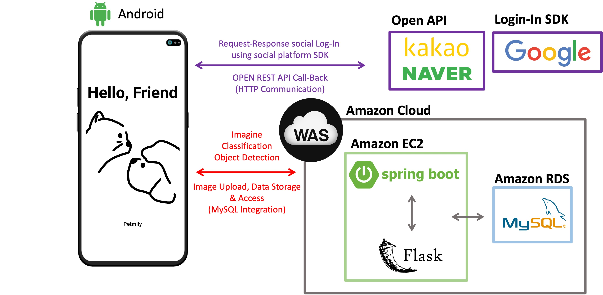
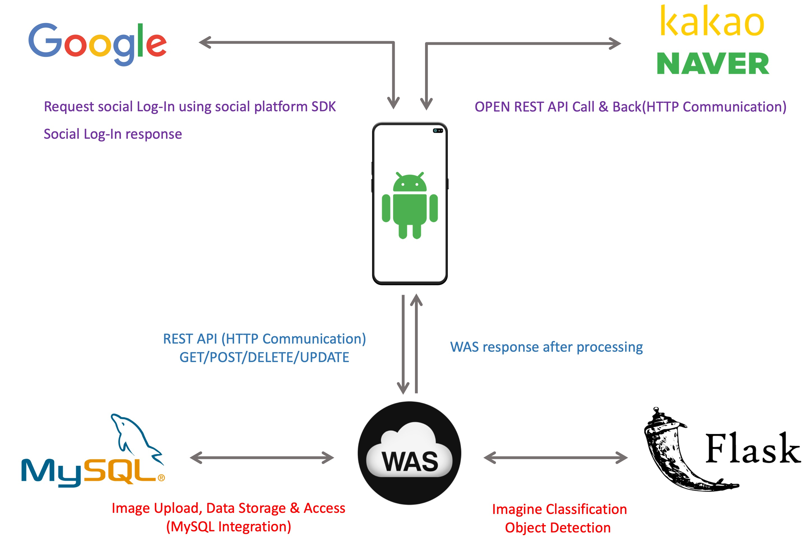
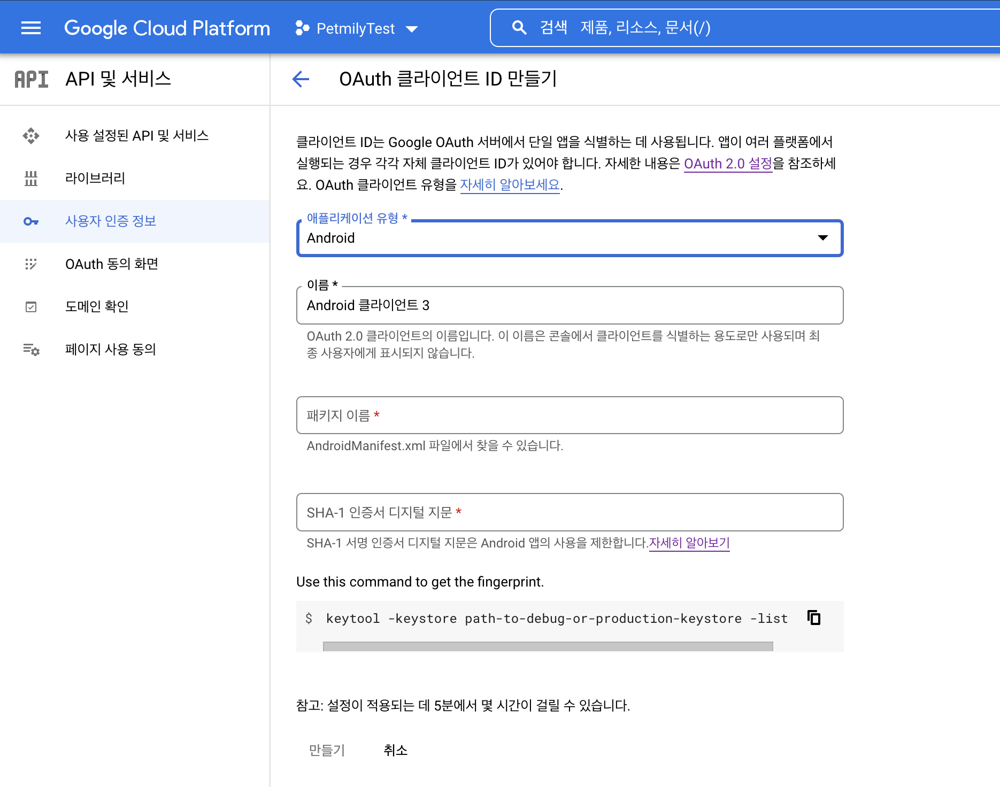
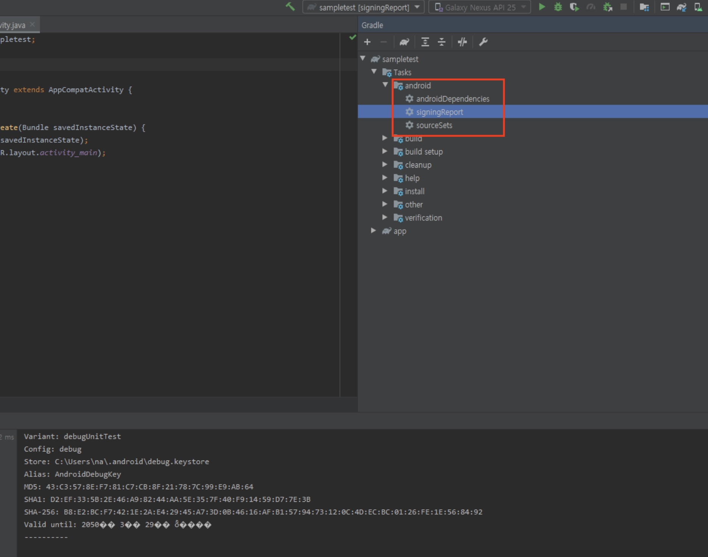
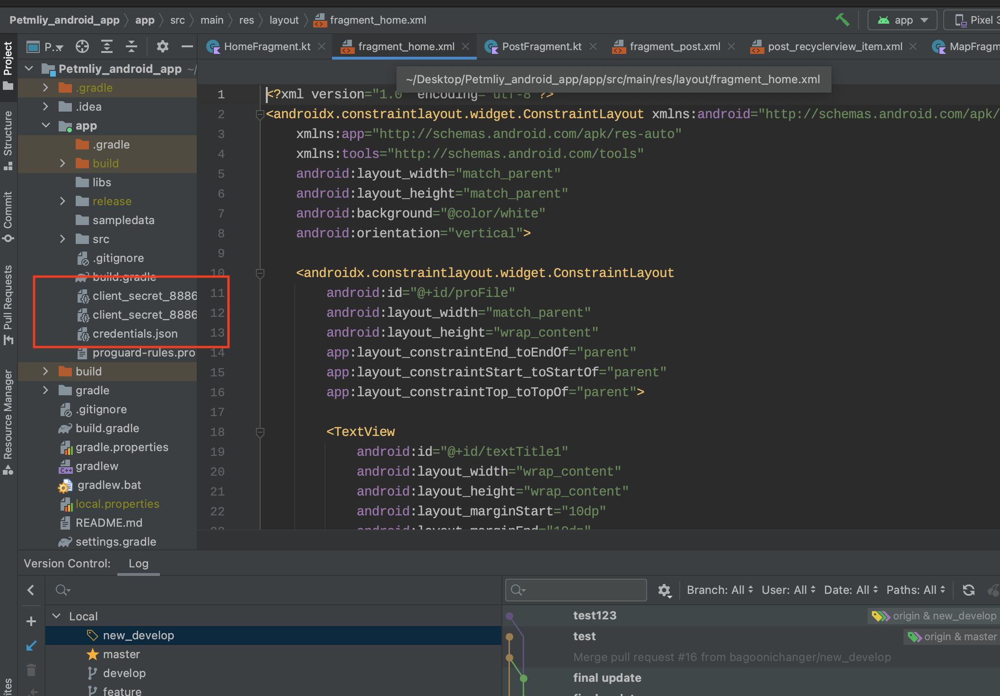
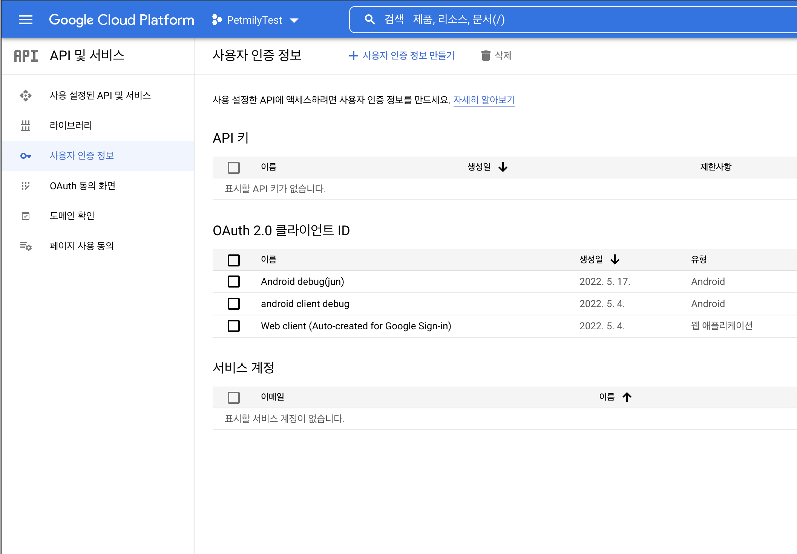

# Petmily Android Application

**2022-1학기 한성대학교 컴퓨터공학부 캡스톤디자인**

## 팀 구성

**팀장** : 박우림(Client)   

**팀원** : 박준석(Server), 주권영(Server), 정예린(Client)

## Server Github

https://github.com/jookwonyoung/petmily-server

https://github.com/wolfdate25/Petmily_flask_server

## 목차

- ### 이용 전, 필요한 부분

### 1. 소개

- 앱 소개
- 주제를 선정하게 된 이유
- 주요 적용 기술
- 구조
- 간략한 기능 설명
- 앱 사용 방법

### 2. 사전 설정 및 환경 구축

- Google

### 3. 기능 구현

### 4. 차별성

### 5. 실용성

### 6. 시장성

### 7.수익화 방안

### 8. 기대효과

### 9. 결론

## 이용 전, 필요한 부분

- 안드로이드 스튜디오 3.4.0 이상의 Version

> [Android Studio Download](https://developer.android.com/studio)

- API Level : API 수준 27 이상(권장 : API 수준 30)

##  1. 소개

### 앱 소개

이 어플리케이션은 총 5가지의 기능을 제공한다.

- 딥러닝을 통한 반려동물 감정 분석
- 딥러닝을 통한 반려동물 종 구분
- 딥러닝을 통한 게시물 자동 태그
- GPS를 이용한 산책 기록 및 관리
- GPS를 이용한 주변 서비스(장소) 검색 및 저장 기능

### 주제를 선정하게 된 이유

많은 미디어 매체에서는 반려동물 관련 콘텐츠를 방영하고, SNS에서는 전용 계정이 생기는 등 반려동물에 대한 관심이 뜨겁다. 하지만 SNS의 광고나 무분별한 게시글로 피로를 느껴, 관심 있는 분야만 즐길 수 있는 플랫폼을 찾는 사용자가 증가하고 있다. 이에 반려동물에 집중한 커뮤니티(SNS)와 반려동물 케어에 도움이 되는 기능을 갖춘 ‘Petmily’ 애플리케이션을 개발하게 되었다.

### 주요 적용 기술

**개발 언어** : Java, Kotlin, Mustache, Python, SQL

**개발 도구** : Android Studio, IntelliJ IDEA, PyTorch, PyCharm

**개발 환경** : Amazon EC2, Amazon RDS, Flask Server, MySQL, Spring Boot

**주요 기술** : Imagine Classification, Object Detection, REST API

### 구조

------

### 간략한 기능 설명

### 앱 사용 방법

## 2. 사전 설정 및 환경 구축

### Google

Server와 Google 로그인을 연동하기 위해서는 Google Cloud Platform에 프로젝트를 등록해야 한다.

------

Google 로그인을 사용 하므로 '디버그 서명 인증서 SHA-1'을 알아야 한다.

<'SHA-1'은 안드로이드 스튜디오 오른쪽에 있는 Gradle -> Tasks->android->signInReport를 클릭 하면 알 수 있다>

------

구성 파일을 다운로드 한 뒤 , 생성된 프로젝트 파일->app 폴더 에다가 저장한다(JSON 형식)

------

#### Android Studio에 google Login SDK 추가 완료

## 3. 기능구현

## 4. 차별성

## 5. 실용성

## 6. 시장성

## 7. 수익성

## 8. 기대효과

- ### 오락성

​		반려동물의 감정을 대략적으로 파악함으로써 재미와 적절한 활용 가능 

- ### 편의성

 		산책 기록 및 관리, 장소 검색 및 저장 기능을 한 애플리케이션에서 손쉽게 이용 가능

- ### 안정성

​		무분별한 이미지를 제한함으로써 사용자들의 피로도 감소

## 9. 결론

이번 프로젝트를 통해 체계적으로 기획부터 계획했던 결과물을 만들어 내는 과정을 직접 경험해 보았습니다.

사용하고 있는 모바일 애플리케이션들의 적용되는 대략적인 구성과 개발 과정을 파악함으로써 팀원들의 각 분야에 맞는 로드맵이 정립되는 시간이었습니다. 그리고, 단순히 개인들의 역량뿐만이 아니라 소통 그리고 협업을 위한 방법 또한 체득할 수 있었기에, 이를 적용하기에는 많은 시간이 들고 크고 작은 어려움들이 있었지만, 모든 부분에서 어떠한 방식으로든 많은 것들을 배울 수 있었습니다. 

 팀원들 모두 프로젝트를 원활히 진행하기 어려워 추가적인 공부를 하면서 프로젝트를 진행하는데 힘들어했지만, 포기하지 않고 마무리를 할 수 있게 되어 감사합니다.
